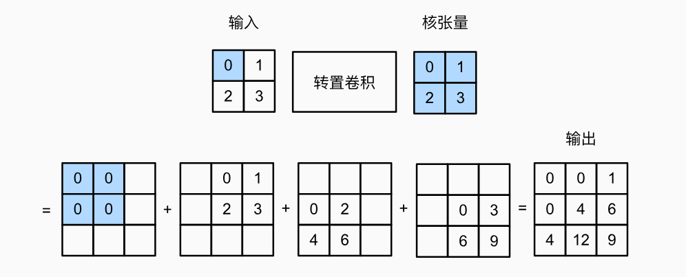
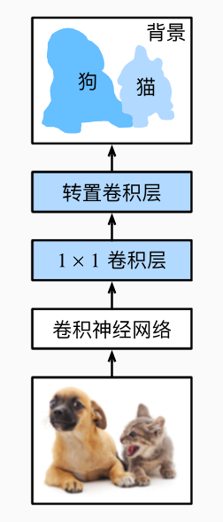

[[toc]]

本文主要介绍计算机视觉中的三个主要问题——**目标检测、语义分割和风格迁移**，所涉及的知识点。

## 目标检测

主要介绍在计算机视觉中目标检测问题的常见处理。在目标检测问题中，常见的网络模型有：单发多框检测（SSD）、区域卷积神经网络（R-CNN）系列、YOLO。但由于篇幅过长，此处不对这些网络模型进行阐述。

### 图像增广

大型数据集是成功应用深度神经网络的先决条件。 图像增广在对训练图像进行一系列的随机变化之后，生成相似但不同的训练样本，从而**扩大了训练集的规模**。 此外，应用图像增广的原因是，随机改变训练样本可以<u>减少</u>模型对某些属性的依赖，从而**提高模型的泛化能力**。

对训练图像进行<u>裁剪、上下左右翻转、调整亮度或颜色</u>等方式来使得模型的泛化能力更强。裁剪和翻转可以减少模型对于对象出现<u>**位置**</u>的依赖，调整图像的亮度或者颜色等其他因素可以降低模型对<u>**颜色**</u>的敏感度。

通常我们会结合多种图像增广的方法来扩大训练集，但我们不会对测试集进行增广：

```python
train_transforms = transforms.Compose([
    transforms.Resize(img_size),
    transforms.RandomHorizontalFlip(),
    transforms.RandomVerticalFlip(),
    torchvision.transforms.ColorJitter(
    brightness=0.5, contrast=0.5, saturation=0.5, hue=0.5),
    transforms.ToTensor(),
])
test_transforms = transforms.Compose([
    transforms.Resize(img_size),
    transforms.ToTensor(),
])
```

### 多尺度锚框

在目标检测中，通常以输入图像的每个像素为中心，来生成多个锚框。 通常而言，这些锚框代表了图像不同区域的样本。 然而，如果为每个像素都生成的锚框，我们最终可能会得到太多需要计算的锚框。

一个做法就是我们可以在输入图像中<u>均匀采样一小部分像素，并以它们为中心生成锚框</u>。

对于不同的网络模型也会采用相应的方式来尽可能地减少锚框的数量：

在 Faster R-CNN 中提出采用*区域提议网络*（region proposal network）。区域提议网络能够学习如何生成高质量的提议区域（锚框），从而减少提议区域的生成数量，并保证目标检测的精度。

在 YOLO 中，将图片均匀分成 S×S 个锚框，每个锚框预测 B 个边界框（因为一个锚框可能包含多个目标类别）。

### 交并比（IoU）

交并比又称为*杰卡德系数*（Jaccard）。在目标检测问题中，要比较生成的锚框和真实边界框之间、以及不同锚框之间的相似度，我们可以通过他们的交并比来衡量。

对于两个边界框，它们的杰卡德系数通常称为*交并比*（intersection over union，**IoU**），即**两个边界框相交面积与相并面积之比**。交并比的取值范围在0和1之间：<u>0表示两个边界框无重合像素，1表示两个边界框完全重合</u>。

### 将真实边界框分配给锚框

在目标检测问题中，对训练集的每个图像生成数个锚框后，需要将对应的锚框与最接近此锚框的真实边界框相对应，以进行后续的训练和预测。 由于篇幅过长，具体可看[动手学深度学习](https://zh.d2l.ai/chapter_computer-vision/anchor.html#id4)。

### 非极大值抑制（NMS）

当有许多锚框时，可能会输出许多相似的具有明显重叠的预测边界框，都围绕着同一目标。 为了简化输出，我们可以使用*非极大值抑制*（non-maximum suppression，**NMS**）合并属于同一目标的类似的预测边界框。

具体算法流程简单来说就是：选择置信度最高的预测边界框作为基准，计算其他预测边界框与该基准边界框的 IoU，<u>移除 IoU 超过给定阈值的其他边界框</u>。循环以上做法，直到不存在有一对边界框的 IoU 超过阈值为止。

------

## 语义分割

### 转置卷积

在之前的图像分类和目标检测问题中，我们通常会使用卷积核来减小输入的高宽并增大通道数，来<u>抽取更多的特征并减少计算量</u>。

但在语义分割问题中，我们需要对输入图像进行像素级别的分类，即为**每个像素分配一个类别标签**。卷积操作会逐渐<u>减少</u>特征图的尺寸（高宽），这使得在后续的网络层中难以恢复原始输入图像的空间分辨率，造成一定的信息损失。而转置卷积能够增加特征图的尺寸，从而有助于**恢复输入图像的空间信息，使得最终的分割结果能够与输入图像尺寸相匹配**。



假设输入的高（宽）为$n$，输出的高（宽）为$n'$，转置卷积核的高（宽）为$k$，填充为$p$，步幅为$s$，则有：
$$
n'=sn+k-2p-s.
$$
与卷积类似，转置卷积中要使得输入的高宽成倍增加，就要使得$k-2p-s=0$，即$k=2p+s$，这样就可以通过步幅来成倍地增加输入的高宽。

### 全卷积神经网络

与之前在图像分类或目标检测所使用的卷积神经网络不同，*全卷积网络*（fully convolutional network，**FCN**）将中间层特征图的高和宽<u>变换回输入图像的尺寸</u>：即通过转置卷积来实现的。因此，输出的类别预测与输入图像**在像素级别上具有一一对应关系**：通道维的输出即该位置对应像素的类别预测。

**基本结构**：全卷积网络先使用卷积神经网络抽取图像特征，然后通过 1×1 卷积层将通道数变换为类别个数，最后通过转置卷积层将特征图的高和宽变换为输入图像的尺寸。



------

## 风格迁移

将一个图像中的风格应用在另一图像之上，即*风格迁移*（style transfer）。因此，要实现风格迁移，我们需要两张输入图像：一张是*内容图像*，另一张是*风格图像*。

**基本结构**：首先，初始化**合成图像**，例如将其初始化为内容图像。 该合成图像是风格迁移过程中唯一需要更新的变量，即风格迁移所需迭代的模型参数。 然后，我们选择一个预训练的卷积神经网络来抽取图像的特征，其中的模型参数在训练中无须更新。 这个深度卷积神经网络凭借多个层逐级抽取图像的特征，我们可以**选择其中某些层的输出作为内容特征或风格特征**。

为了抽取图像的内容特征和风格特征，我们可以选择卷积神经网络中某些层的输出。 一般来说，**越靠近输入层，越容易抽取图像的细节信息；反之，则越容易抽取图像的全局信息。** 为了避免合成图像过多保留内容图像的细节，选择较靠近输出的层，即*内容层*，来输出图像的内容特征；分别选择不同层的输出来匹配局部和全局的风格，这些图层也称为*风格层*。 

我们把内容层和风格层的输出分别抽取出来，存在对应的数组当中，再去对这两者去计算损失。

风格迁移常用的<u>损失函数</u>由3部分组成：

1. *内容损失*使合成图像与内容图像在**内容特征**上接近

   与线性回归中的损失函数类似，内容损失通过**平方误差**函数衡量合成图像与内容图像在内容特征上的差异。

2. *风格损失*使合成图像与风格图像在**风格特征**上接近

   风格损失与内容损失类似，也通过平方误差函数衡量合成图像与风格图像在风格上的差异。但为了表达风格层输出的风格，我们需要将风格层的输出转换为对应的*格拉姆矩阵*。详细请看[动手学深度学习](https://zh.d2l.ai/chapter_computer-vision/neural-style.html#id10)。

3. *全变分损失*则有助于减少合成图像中的噪点

   通常而言，学到的合成图像里面可能会有大量高频噪点，即有特别亮或者特别暗的颗粒像素。 一种常见的去噪方法是*全变分去噪*（total variation denoising）：假设$x_{i,j}$表示坐标$(i,j)$处的像素值，降低全变分损失
   $$
   \sum_{i,j}\mid{x_{i,j}-x_{i+1,j}}\mid+\mid{x_{i,j}-x_{i,j+1}}\mid.
   $$
   能够尽可能使邻近的像素值相似，从而尽可能的去除噪点。