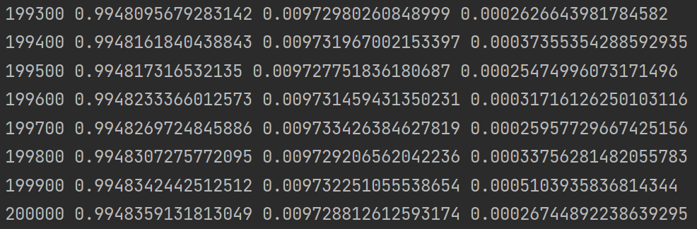

[[toc]]

整个代码实现基于 Pytorch 。

## 问题定义

**Navier-Stokes** 方程定义如下：
$$
u_t+\lambda_1(uu_x+vu_y)=-p_x+\lambda_2(u_{xx}+u_{yy}),
$$

$$
v_t+\lambda_1(uv_x+vv_y)=-p_y+\lambda_2(v_{xx}+v_{yy}).
$$

式中，$u(t,x,y)$是$x$轴的速度场，$v(t,x,y)$是$y$轴的速度场，$p(t,x,y)$是压力场，三者都是非定常的。参数$\lambda=(\lambda_1,\lambda_2)$是需要反演的未知参数，真实值分别为 $1$ 和 $0.01$。

网络的输出应该为三维$(u,v,p)$，但由于Navier-Stokes的解满足下面散度为0的方程，即：
$$
u_x+v_y=0.
$$
速度场$u$和$v$又可以看做流量场的导数，即：
$$
u=\psi_y，v=-\psi_x.
$$
因此，网络的输出维度可以由三维转变为二维$(\psi,p)$。

## 网络模型定义

采用 MLP 来实现 PINN的神经网络模型，隐藏层的激活函数选择 Tanh。

```python
class PINN(nn.Module):
    def __init__(self, input_size, hidden_size, output_size, depth=8, act=nn.Tanh):
        super(PINN, self).__init__()
        layers = [torch.nn.Linear(input_size, hidden_size), act()]
        for i in range(depth):
            layers.append(torch.nn.Linear(hidden_size, hidden_size))
            layers.append(act())
        layers.append(torch.nn.Linear(hidden_size, output_size))
        self.layers = nn.Sequential(*layers)

    def forward(self, x):
        return self.layers(x)
```

## 读取训练集数据

训练集数据来源于 PINN 原作者 Maziar Raissi 的 GitHub：[maziarraissi/PINNs: Physics Informed Deep Learning](https://github.com/maziarraissi/PINNs)。

由于本实现没有去做验证，所以这里没有读取 p 的标签数据。

```python
def initData():
    N_train = 5000
    # 获取训练数据集
    data = scipy.io.loadmat('./data/cylinder_nektar_wake.mat')
    U_label = data['U_star'].astype(np.float32)  # N x 2 x T
    # p_label = data['p_star'].astype(np.float32).flatten()[:, None]  # N x T
    t_label = data['t'].astype(np.float32).flatten()[:, None]  # T x 1
    X_label = data['X_star'].astype(np.float32)  # N x 2

    N = X_label.shape[0]
    T = t_label.shape[0]

    x = np.tile(X_label[:, 0:1], (1, T)).flatten()[:, None]  # NT x 1
    y = np.tile(X_label[:, 1:2], (1, T)).flatten()[:, None]  # NT x 1
    t = np.tile(t_label, (1, N)).T.flatten()[:, None]  # NT x 1
    u = U_label[:, 0, :].flatten()[:, None]  # NT x 1
    v = U_label[:, 1, :].flatten()[:, None]  # NT x 1

    idx = np.random.choice(N * T, N_train, replace=False)
    x_train = torch.from_numpy(x[idx, :]).requires_grad_(True)
    y_train = torch.from_numpy(y[idx, :]).requires_grad_(True)
    t_train = torch.from_numpy(t[idx, :]).requires_grad_(True)
    X_train = torch.cat([x_train, y_train, t_train], dim=1)
    u_train = torch.from_numpy(u[idx, :]).flatten().requires_grad_(True)
    v_train = torch.from_numpy(v[idx, :]).flatten().requires_grad_(True)

    X_train = X_train.to(device)
    u_train = u_train.to(device)
    v_train = v_train.to(device)

    return X_train, u_train, v_train
```

## 损失函数

PDE 方程的偏差项可定义为：
$$
f:=u_t+\lambda_1(uu_x+vu_y)=-p_x+\lambda_2(u_{xx}+u_{yy}),
$$

$$
g:=u_t+\lambda_1(uu_x+vu_y)=-p_x+\lambda_2(u_{xx}+u_{yy}).
$$

损失主要包括偏微分结构损失（PDE loss）和真实数据条件损失（Data loss）：
$$
PDE\ loss:=\frac{1}{N}\sum^N_{i=1}(\mid u(t^i,x^i,y^i)-u^i\mid^2+\mid v(t^i,x^i,y^i)-v^i\mid^2),
$$

$$
Data\ loss:=\frac{1}{N}\sum^N_{i=1}(\mid f(t^i,x^i,y^i)\mid^2+\mid g(t^i,x^i,y^i)\mid^2),
$$

$$
MSE:=PDE\ loss+Data\ loss.
$$

```python
def NS_PDE_1(u, v, du_dx, du_dy, du_dt, du_dxx, du_dyy, dp_dx, l1, l2):
    return du_dt + l1 * (u * du_dx + v * du_dy), -dp_dx + l2 * (du_dxx + du_dyy)

def NS_PDE_2(u, v, dv_dx, dv_dy, dv_dt, dv_dxx, dv_dyy, dp_dy, l1, l2):
    return dv_dt + l1 * (u * dv_dx + v * dv_dy), -dp_dy + l2 * (dv_dxx + dv_dyy)

def d(f, x):
    return torch.autograd.grad(f, x,
                               grad_outputs=torch.ones_like(f),
                               retain_graph=True,
                               create_graph=True)[0]

# 对于逆问题，即方程中的某些参数未知。
# 若只知道PDE方程及边界条件，PDE参数未知，该逆问题为非定问题，所以必须要知道其他信息，如部分观测点的值。
# 在这种情况下，PINN做法可将方程中的参数作为未知变量，加到训练器中进行优化，损失函数包括Data loss。
def loss_func():
    global index  # 计数
    optimizer_adam.zero_grad()
    optimizer_lbfgs.zero_grad()

    # 第一部分loss:内点非物理产生的loss PDE loss
    psi_and_p = model(X_train)
    psi = psi_and_p[:, 0:1]
    p = psi_and_p[:, 1:2]
    # 求psi对x、y的导数得到u、v
    U = d(psi, X_train)
    u = U[:, 1]
    v = -U[:, 0]
    # 使用自动求导方法得到u、v对x、y、t的导数
    du_dX = d(u, X_train)
    dv_dX = d(v, X_train)
    du_dx = du_dX[:, 0]
    du_dy = du_dX[:, 1]
    du_dt = du_dX[:, 2]
    dv_dx = dv_dX[:, 0]
    dv_dy = dv_dX[:, 1]
    dv_dt = dv_dX[:, 2]
    # 使用自动求导方法得到p对x、y的导数
    dp_dX = d(p, X_train)
    dp_dx = dp_dX[:, 0]
    dp_dy = dp_dX[:, 1]
    # 使用自动求导方法得到u、v对x、y的二阶导数
    du_dXX = d(du_dX, X_train)
    du_dxx = du_dXX[:, 0]
    du_dyy = du_dXX[:, 1]
    dv_dXX = d(dv_dX, X_train)
    dv_dxx = dv_dXX[:, 0]
    dv_dyy = dv_dXX[:, 1]

    left_1, right_1 = NS_PDE_1(u, v, du_dx, du_dy, du_dt, du_dxx, du_dyy, dp_dx, lambda_1, lambda_2)
    left_2, right_2 = NS_PDE_2(u, v, dv_dx, dv_dy, dv_dt, dv_dxx, dv_dyy, dp_dy, lambda_1, lambda_2)
    loss_PDE_1 = criterion(left_1, right_1)
    loss_PDE_2 = criterion(left_2, right_2)
    loss_PDE = loss_PDE_1 + loss_PDE_2

    # 第二部分loss:Data loss
    loss_data_u = criterion(u, u_train)
    loss_data_v = criterion(v, v_train)
    loss_data = loss_data_u + loss_data_v

    loss = loss_PDE + loss_data
    loss.backward()

    if index % 100 == 0:
        print(index, lambda_1.item(), lambda_2.item(), loss.item())
    index = index + 1
    return loss
```

## 训练

网络一共包含 8 个隐藏层，每层 20 个隐藏单元。优化算法采用 Adam，通过 Xavier 进行模型的权重初始化。

模型非常难收敛，一共进行了 20 万次 epoch 的训练。

```python
def train(model, epochs_adam):
    model.train()
    for epoch in range(epochs_adam):
        optimizer_adam.step(loss_func)


def init_weights(m):
    if type(m) == nn.Linear:
        nn.init.xavier_uniform_(m.weight)


device = torch.device("cuda") if torch.cuda.is_available() else torch.device("cpu")

input_size = 3
hidden_size = 20
output_size = 2
epochs_adam = 200000
index = 1

model = PINN(input_size, hidden_size, output_size)
model.apply(init_weights)
model.to(device)

criterion = torch.nn.MSELoss()
optimizer_adam = torch.optim.Adam(model.parameters(), lr=0.001)

X_train, u_train, v_train = initData()
# lambda_1 = 1
lambda_1 = torch.tensor(np.array([0])).float().to(device).requires_grad_(True)
lambda_1.grad = torch.ones((1)).to(device)
# lambda_2 = 0.01
lambda_2 = torch.tensor(np.array([0])).float().to(device).requires_grad_(True)
lambda_2.grad = torch.ones((1)).to(device)
# 将未知参数添加进优化器中进行训练
optimizer_adam.add_param_group({'params': lambda_1, 'lr': 0.00001})
optimizer_adam.add_param_group({'params': lambda_2, 'lr': 0.00001})
train(model, epochs_adam)
```

## 结果



第一个打印值为当前的 epoch，第二个为$\lambda_1$，第三个为$\lambda_2$，最后一个为 loss。可以发现经过 20 万次训练，模型才能几近收敛。最终训练得到的$\lambda_1\approx0.99$，$\lambda_2\approx0.0097$，都非常接近真实解 $1$ 和 $0.01$。
