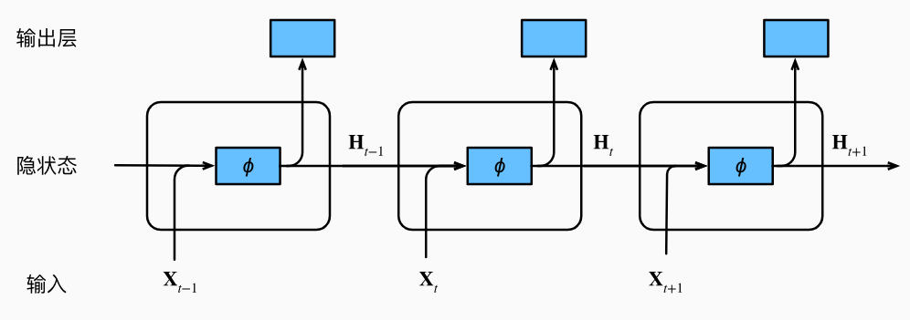
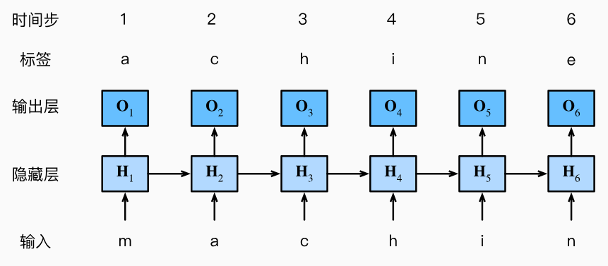
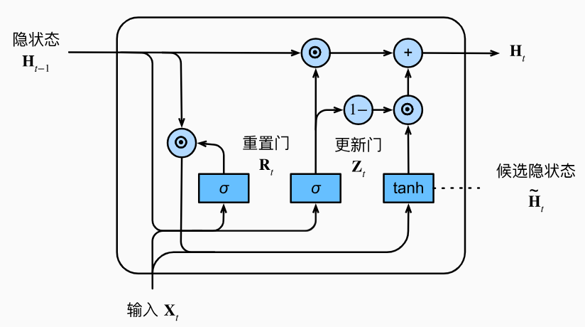
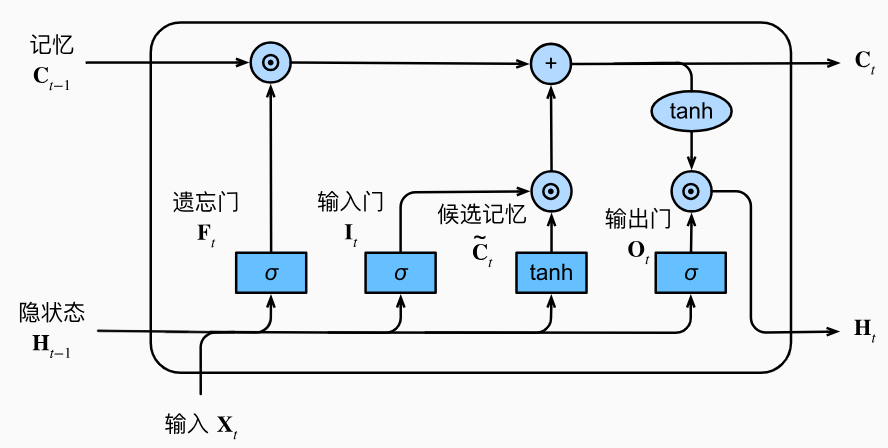
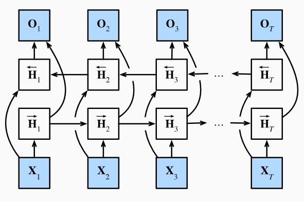

[[toc]]

对于 NLP 问题，循环神经网络是一种常用的网络结构方案。

## 读取长序列数据

在 NLP 问题中，由于我们的数据为一个长序列，因此小批量数据的获取的方法与之前的介绍的问题有所不同。

### 随机采样

在随机采样中，每个样本都是在原始的长序列上**任意捕获**的子序列。 在迭代过程中，来自两个相邻的、随机的、小批量中的子序列不一定在原始序列上相邻。对于语言建模，目标是基于到目前为止我们看到的词元来预测下一个词元， 因此**标签是移位了一个词元的原始序列**。

```python
def seq_data_iter_random(corpus, batch_size, num_steps):  #@save
    """使用随机抽样生成一个小批量子序列"""
    # 从随机偏移量开始对序列进行分区，随机范围包括num_steps-1
    corpus = corpus[random.randint(0, num_steps - 1):]
    # 减去1，是因为我们需要考虑标签
    num_subseqs = (len(corpus) - 1) // num_steps
    # 长度为num_steps的子序列的起始索引
    initial_indices = list(range(0, num_subseqs * num_steps, num_steps))
    # 在随机抽样的迭代过程中，
    # 来自两个相邻的、随机的、小批量中的子序列不一定在原始序列上相邻
    random.shuffle(initial_indices)

    def data(pos):
        # 返回从pos位置开始的长度为num_steps的序列
        return corpus[pos: pos + num_steps]

    num_batches = num_subseqs // batch_size
    for i in range(0, batch_size * num_batches, batch_size):
        # 在这里，initial_indices包含子序列的随机起始索引
        initial_indices_per_batch = initial_indices[i: i + batch_size]
        X = [data(j) for j in initial_indices_per_batch]
        Y = [data(j + 1) for j in initial_indices_per_batch]
        yield torch.tensor(X), torch.tensor(Y)
```

### 顺序分区

除了对原始序列可以随机抽样外， 我们还可以保证两个相邻的小批量中的子序列在原始序列上也是相邻的。 这种策略在基于小批量的迭代过程中**保留了拆分的子序列的顺序**，因此称为顺序分区。

```python
def seq_data_iter_sequential(corpus, batch_size, num_steps):  #@save
    """使用顺序分区生成一个小批量子序列"""
    # 从随机偏移量开始划分序列
    offset = random.randint(0, num_steps)
    num_tokens = ((len(corpus) - offset - 1) // batch_size) * batch_size
    Xs = torch.tensor(corpus[offset: offset + num_tokens])
    Ys = torch.tensor(corpus[offset + 1: offset + 1 + num_tokens])
    Xs, Ys = Xs.reshape(batch_size, -1), Ys.reshape(batch_size, -1)
    num_batches = Xs.shape[1] // num_steps
    for i in range(0, num_steps * num_batches, num_steps):
        X = Xs[:, i: i + num_steps]
        Y = Ys[:, i: i + num_steps]
        yield X, Y
```

------

## 循环神经网络

单词$x_t$在时间步$t$的条件概率仅取决于前面$n-1$个单词。对于时间步$t-(n-1)$之前的单词，如果想要将其可能产生的影响合并到$x_t$上，需要怎加$n$，然而模型参数的数量也会随之呈指数增长。因此，可以使用隐变量模型：其中$h_{t-1}$是*隐状态*（hidden state）， 也称为*隐藏变量*（hidden variable），它存储了到时间步$t-1$的序列信息。

而*循环神经网络*（recurrent neural networks，**RNNs**）就是**具有隐状态的神经网络**。 

### 隐状态

先来看一看只有单隐藏层的多层感知机。假设隐藏层的激活函数为$\phi$，给定一个小批量样本$X\in R^{n\times d}$，其中批量大小为$n$，输入个数为$d$，则则隐藏层的输出$H\in R^{n\times h}$通过下式计算：
$$
H=\phi(XW_{xh}+b_h).
$$
有了隐状态后，情况就完全不同了。与多层感知机不同的是， 我们在这里保存了前一个时间步的隐藏变量$H_{t-1}$，并引入了一个新的权重参数$W_{hh}$，来描述如何在当前时间步中使用前一个时间步的隐藏变量。具体地说，当前时间步的隐藏变量**由当前时间步的输入与前一个时间步的隐藏变量一起计算**得出：
$$
H_t=\phi(XW_{xh}+H_{t-1}W_{hh}+b_h).
$$
$H_t$捕获并保留了序列直到其当前时间步的历史信息， 就像当前时间步下神经网络的状态或记忆， 因此这样的隐藏变量被称为*隐状态*（hidden state）。



### 基于循环神经网络的语言模型



在训练过程中，我们对每个时间步的输出层的输出进行 *softmax* 操作， 然后利用**交叉熵损失**计算模型输出和标签之间的误差。 在<u>读取长序列</u>部分已讲到：**标签是移位了一个词元的原始序列**。

### 困惑度（Perplexity）

一个好的语言模型能够用高度准确的词元来预测我们接下来会看到什么。我们可以通过一个序列中所有的$n$个词元的交叉熵损失的平均值来衡量：
$$
\frac{1}{n}\sum^n_{t=1}-logP(x_t \mid x_{t-1},\dots,x_1),
$$
其中$P$由语言模型给出，$x_t$是在时间步$t$从该序列中观察到的实际词元。 由于历史原因，自然语言处理的科学家更喜欢使用一个叫做*困惑度*（perplexity）的量。 简而言之，即上式的指数：
$$
exp\left(\frac{1}{n}\sum^n_{t=1}-logP(x_t \mid x_{t-1},\dots,x_1)\right).
$$

- 在最好的情况下，模型总是完美地估计标签词元的概率为1。 在这种情况下，模型的困惑度为1
- 在最坏的情况下，模型总是预测标签词元的概率为0。 在这种情况下，困惑度是正无穷大

### 梯度剪裁

对于长度为$T$的序列，我们在迭代中计算这$T$个时间步上的梯度， 将会在反向传播过程中产生长度为$O(T)$的矩阵乘法链。当$T$较大时，它可能导致数值不稳定， 例如可能导致梯度爆炸或梯度消失。**梯度剪裁**也是处理数值不稳定问题的一种方法。

通过将梯度$g$<u>投影回</u>给定半径 （例如$\theta$）的球来裁剪梯度$g$：
$$
g\leftarrow min\left(1,\frac{\theta}{\parallel g\parallel}\right)g.
$$
通过这样做，可以发现**梯度的范数永远不会超过$\theta$，并且更新后的梯度完全与$g$的原始方向对齐**。梯度裁剪提供了一个快速修复梯度爆炸的方法， 虽然它并不能完全解决问题，但它是众多有效的技术之一。

------

## 门控循环单元（GRU）

在刚刚的循环神经网络结构当中，还存在着一些问题：

- **早期观测值**对预测所有未来观测值具有非常重要的意义。 我们希望有某些机制能够在一个记忆元里存储重要的早期信息。 如果没有这样的机制，我们将不得不给这个观测值指定一个非常大的梯度来存储。
- 一些词元没有相关的观测值。我们希望有一些机制来***跳过***隐状态表示中的**无关**词元。
- 序列的各个部分之间**存在逻辑中断**。例如，书的章节之间可能会有过渡存在， 或者证券的熊市和牛市之间可能会有过渡存在。 在这种情况下，最好有一种方法来***重置***我们的内部状态表示。

针对这些问题， *门控循环单元*（gated recurrent unit，**GRU**）是一个很好的解决方法。

门控循环单元与普通的循环神经网络之间的<u>关键区别</u>在于： **前者支持隐状态的门控**。 这意味着模型有专门的机制来确定应该**何时更新隐状态**， 以及应该**何时重置隐状态**。 这些机制是可学习的，并且能够解决了上面列出的问题。



### 重置门和更新门

*重置门*（reset gate）允许我们控制“可能还想记住”的过去状态的数量； *更新门*（update gate）将允许我们控制新状态中有多少个是旧状态的副本。

对于给定的时间步$t$，假设输入是一个小批量$X\in R^{n\times d}$（批量大小为$n$，输入个数为$d$），上一个时间步的隐状态是$H\in R^{n\times h}$（隐藏单元个数$h$）。 那么，重置门$R_t\in R^{n\times h}$和更新门$Z_t\in R^{n\times h}$的计算如下所示：
$$
R_t=\sigma(XW_{xr}+H_{t-1}W_{hr}+b_r).
$$

$$
Z_t=\sigma(XW_{xz}+H_{t-1}W_{hz}+b_z).
$$

其中$\sigma$为激活函数 sigmoid 。

### 候选隐状态

将重置门$R_t$与常规隐状态更新机制集成，得到在时间步$t$的***候选隐状态***（candidate hidden state）$\tilde H_t$：
$$
\tilde H_t=tanh(XW_{xh}+(R_t⊙H_{t-1})W_{hh}+b_h).
$$
$R_t$与$H_{t-1}$相乘可以减少以往状态的影响。当重置门$R_t$中的项**接近1**时，即候选隐状态等价于之前普通循环神经网络中的常规隐状态；当重置门$R_t$中的项**接近0**时，候选隐状态是以$X_t$作为输入的多层感知机的结果，即**任何预先存在的隐状态**都会被*重置*为默认值。

### 更新隐状态

上述的计算结果只是候选隐状态，我们仍然需要结合更新门$Z_t$来更新隐状态。这一步确定新的隐状态$H_t$多大长度上来自旧的状态$H_{t-1}$和新的候选隐状态$\tilde H_t$：
$$
H_t=Z_t⊙H_{t-1}+(1-Z_t)⊙\tilde H_t.
$$
当更新门$Z_t$**接近1**时，模型就倾向<u>只保留旧状态</u>。 此时，来自$X_t$的信息基本上被忽略， 从而有效地跳过了依赖链条中的时间步$t$。当更新门$Z_t$**接近0**时，新的隐状态$H_t$就会<u>接近候选隐状态$\tilde H_t$</u>。

这样的设计可以很好地处理循环神经网络中的梯度消失问题， 并更好地捕获时间步距离很长的序列的依赖关系。例如，如果整个子序列的所有时间步的更新门都接近于1， 则无论序列的长度如何，在**序列起始时间步的旧隐状态都将很容易保留并传递到序列结束**。

------

## 长短期记忆网络（LSTM）

除了 GRU 外，最早解决这些问题的方法之一就是长短期存储器（long short-term memory，**LSTM**）。



### 输入门、忘记门和输出门

*输出门*（output gate）用来从单元中输出条目。 *输入门*（input gate）用来决定何时将数据读入单元。 *遗忘门*（forget gate）重置单元的内容。

相应地，时间步$t$的门被定义如下：输入门$I_t$，遗忘门$F_t$，输出门$O_t$。这三者的计算方法如下：
$$
I_t=\sigma(XW_{xi}+H_{t-1}W_{hi}+b_i),
$$

$$
F_t=\sigma(XW_{xf}+H_{t-1}W_{hf}+b_f),
$$

$$
O_t=\sigma(XW_{xo}+H_{t-1}W_{ho}+b_o).
$$

其中$\sigma$为激活函数 sigmoid 。

### 候选记忆元

*候选记忆元*（candidate memory cell）与 GRU 的候选隐状态类似。但候选记忆元$\tilde C_t$与上述的三个门的计算相似，但是使用 tanh 作为激活函数：
$$
\tilde C_t=tanh(XW_{xc}+H_{t-1}W_{hc}+b_c).
$$

### 记忆元

长短期记忆网络引入了*记忆元*（memory cell），或简称为*单元*（cell）。 有些文献认为记忆元是隐状态的一种特殊类型， 它们与隐状态具有相同的形状，其设计目的是用于记录附加的信息。

在门控循环单元中，有一种机制来控制输入和遗忘（或跳过）。 类似地，在长短期记忆网络中，也有两个门用于这样的目的： 输入门$I_t$控制采用多少来自候选记忆元$\tilde C_t$的新数据，而遗忘门$F_t$控制保留多少过去的记忆元$C_{t-1}$的内容。其计算方法如下：
$$
C_t=F_t⊙C_{t-1}+I_t⊙\tilde C_t
$$

### 更新隐状态

时间步$t$的隐状态$H_t$将会由输出门$O_t$和记忆元$C_t$共同决定：
$$
H_t=O_t⊙tanh(C_t)
$$
当输出门$O_t$接近1时，就能够有效地将所有记忆信息传递给预测部分；当输出门$O_t$接近0时，只保留记忆元内的所有信息，而不需要更新隐状态。

------

## 深度循环神经网络

之前介绍的网络都属于具有一个单向的隐藏层的循环神经网络。要获得更多的非线性，可以将多层循环神经网络堆叠在一起，使用多个隐藏层组成***深度循环神经网络***。在深度循环神经网络中，隐状态的信息被传递到**当前层的下一时间步和下一层的当前时间步**。

------

## 双向循环神经网络

当我们想要通过未来预测过去的信息，通常会通过双向循环神经网络来实现。增加一个“从最后一个词元开始**从后向前运行**”的循环神经网络，即可使得网络具有一定的前瞻能力。***双向循环神经网络***（bidirectional RNNs） 添加了反向传递信息的隐藏层，以便更灵活地处理此类信息。



双向循环神经网络的一个关键特性是：使用来自序列<u>两端</u>的信息来估计输出。 也就是说，我们使用来自过去和未来的观测信息来预测当前的信息。 但是在对下一个词元进行预测的情况中，这样的模型并不是我们所需的。 因为在预测下一个词元时，我们终究**无法知道下一个词元的下文是什么**， 所以将不会得到很好的精度。 具体地说，在训练期间，我们能够利用过去和未来的数据来估计现在空缺的词； 而在测试期间，我们<u>只有过去的数据，因此精度将会很差</u>。

另一个严重问题是，双向循环神经网络的**计算速度非常慢**。 其主要原因是网络的前向传播需要在双向层中进行前向和后向递归， 并且网络的反向传播还依赖于前向传播的结果。 因此，梯度求解将有一个非常长的链。

因此，双向循环神经网络一般用来对序列抽取特征，而不是预测未来。通常应用于机器翻译、填充缺失的单词、词元注释。
