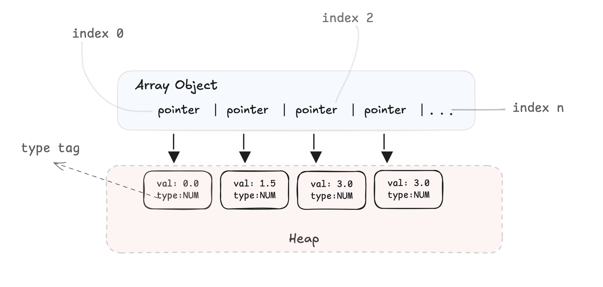

[[toc]]

## 什么是 AoS 和 SoA？

1. **AoS（ Array of Structures）**

   将多个对象（结构体）实例按顺序存储在数组中，每个结构体包含了对象的所有属性。

   ```
   [ { x: number, y: number, z: number }, { x: number, y: number, z: number }, { x: number, y: number, z: number } ]
   ```

2. **SoA（Structure of Arrays）**

   用一个对象（结构体）来存储所有对象的属性，但这个对象的每个成员都是一个独立的数组，分别存放所有对象的同一个属性。

   ```
   {
       x: [x1, x2, x3, ...],
       y: [y1, y2, y3, ...],
       z: [z1, z2, z3, ...],
   }
   ```

很显然，AoS 更符合直觉，面向对象，方便开发者对每个对象进行操作。而 SoA 这种存储方式的好处则在于它对**缓存友好**，不同对象的同一个属性在**内存中连续存储**，可以充分利用 CPU 缓存和向量化指令（SIMD）加快访问速度。接下来我们就来做几个小实验来说明这一点。

## AoS vs. SoA

### 实验

我们分别在两种不同模式下存储**一百万个**三维坐标点，比较这两者模式下计算所有三维坐标点总和所花费的时间：

```js
function AoS() {
  const points = new Array(N)
  for (let i = 0; i < N; i++) {
    points[i] = { x: Math.random(), y: Math.random(), z: Math.random() }
  }

  let sum = 0
  const prev = performance.now()
  for (let i = 0; i < N; i++) sum += points[i].x + points[i].y + points[i].z
  console.log(`AoS 花费的时间：${(performance.now() - prev).toFixed(4)}ms`)
}

function SoA() {
  const points = {
    x: new Array(N),
    y: new Array(N),
    z: new Array(N),
  }
  for (let i = 0; i < N; i++) {
    points.x[i] = Math.random()
    points.y[i] = Math.random()
    points.z[i] = Math.random()
  }

  let sum = 0
  const prev = performance.now()
  for (let i = 0; i < N; i++) sum += points.x[i] + points.y[i] + points.z[i]
  console.log(`SoA 花费的时间：${(performance.now() - prev).toFixed(4)}ms`)
}

const N = 1000000
AoS()
SoA()
```

经过 100 次实验最终取平均值，其结果如下：

| 存储模式                   | 花费时间   |
| -------------------------- | ---------- |
| AoS（Array of Structures） | 10.3483 ms |
| SoA（Structure of Arrays） | 2.4796 ms  |

可以发现，SoA 比 AoS 快了将近 **5 倍**！

### 原因

如果你有计算机背景或者学习过其他的强类型语言（例如 C 或 C++），都会很自然地认为数组中的数据在内存中应该是连续存储的。

这一点在 JS 中会不太相同。准确地说，V8 引擎中的数组并非传统意义上的 “连续内存数组”，而是会根据**元素类型**和是否连续（稀疏数组）采用不同的存储策略。

当数组中仅存储数字（JavaScript 中的 `Number` 类型，本质是 64 位双精度浮点数）且**无空洞**（即数组索引连续，中间无未定义的索引）时，V8 会采用**类型专一的紧凑数组**（PACKED_SMI_ELEMENTS 或 PACKED_DOUBLE_ELEMENTS）来优化数组存储方式。此时，数组底层是**连续的内存块**，每个地址直接存放对应的值本身，无需间接引用堆内存。在这种情况下，由于不需要通过指针寻址到堆中的数据，因此访问速度极快。

而对于其他原始值（包括：`String`、`Boolean`、`Symbol`、`null`、`undefined`）以及引用数据（对象），当数组中包含这些值时，V8 会转换为**通用元素数组**（PACKED_ELEMENTS 或 HOLEY_ELEMENTS）。此时，数组底层虽仍是连续的内存块，但每个索引地址**中不再直接存储原始值本身**，而是存储**对应原始值的堆对象的引用（指针）**。这导致每次访问需要经过：从数组中加载指针->通过指针寻址到堆中的对象，因此效率远低于纯数字数组。



明确 V8 对数组的优化之后，再来看 AoS 和 SoA 两种模式下访问速度不同的原因就很清楚了。

AoS 模式下数组存储的是关于三维坐标的对象，这导致每次计算时都需要经过指针寻址的过程，虽然 AoS 数组中的**对象引用（指针）** 本身在内存中是连续的，但每个引用所指向的**对象本体**在堆内存中的位置是**不保证连续**的，因此也不能很好地利用缓存加快访问。

而 SoA 模式中每个三维坐标属性都是一个纯数字数组，每次计算时 CPU 可以直接获取到内存中对应的值快速完成计算，还可以高效地预取后续数据到 CPU 缓存中。因此在这个情况下，SoA 自然会比 AoS 的性能更好。

## 总结

AoS 与 SoA 作为两种不同的数据存储范式，各有其适用场景。AoS 以**面向对象的组织形式**契合开发者直觉，在单对象的增删改查场景中更具可读性与易用性；而 SoA 凭借**属性数据的连续存储特性**，能够充分利用 CPU 缓存的空间局部性与 V8 引擎的紧凑数组优化，在大数据量批量运算场景下具备显著的性能优势。

在开发中，无需拘泥于哪个单一的模式，应根据实际的业务需求来选择合适的数组存储模式。

## 参考资料

[Why Object of Arrays (SoA pattern) beat interleaved arrays: a JavaScript performance rabbit hole | Royal Bhati's Blog](https://www.royalbhati.com/posts/js-array-vs-typedarray)
