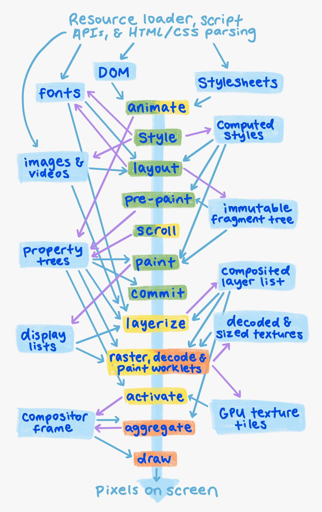
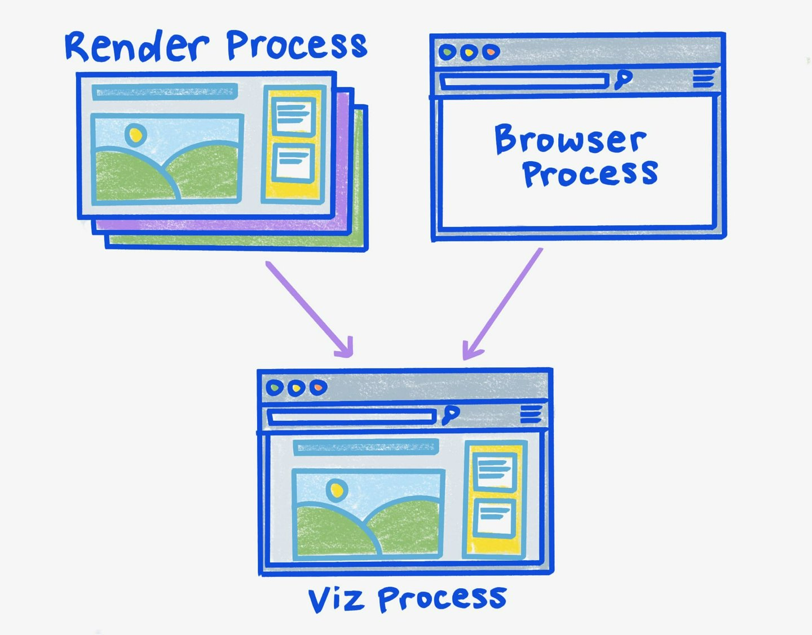
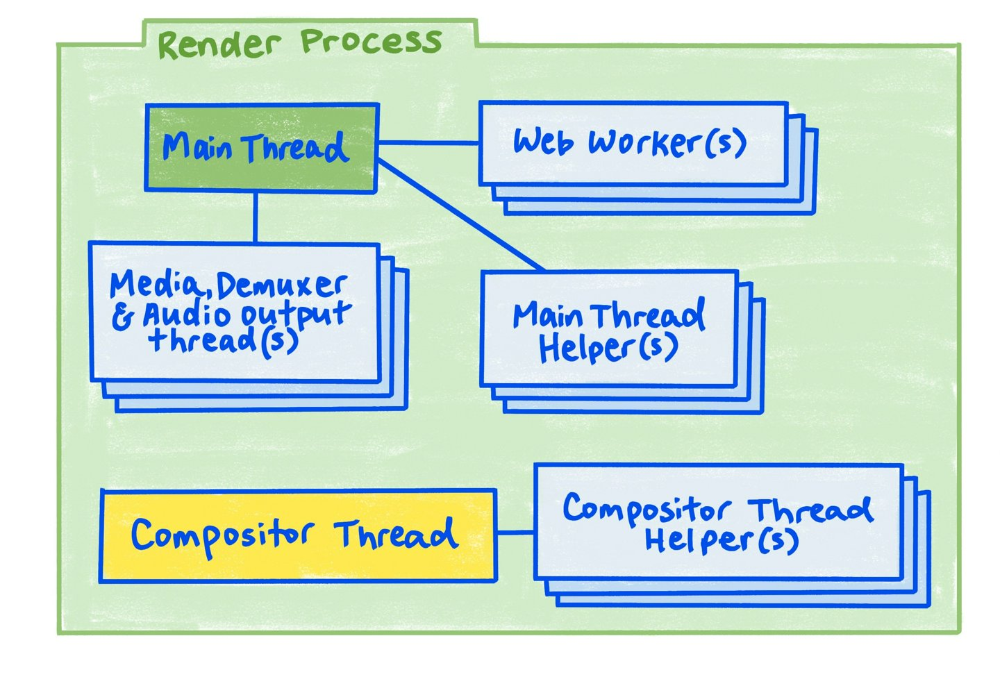
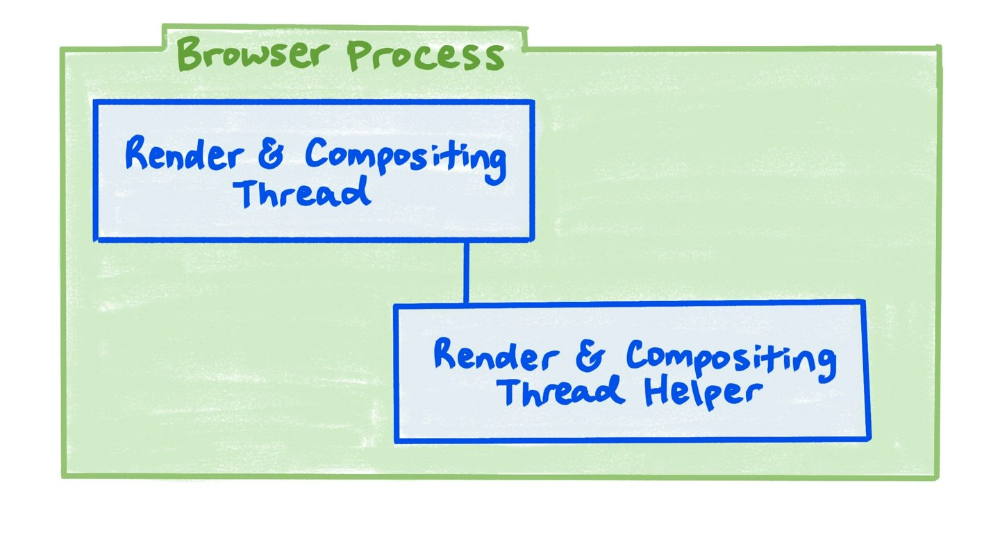
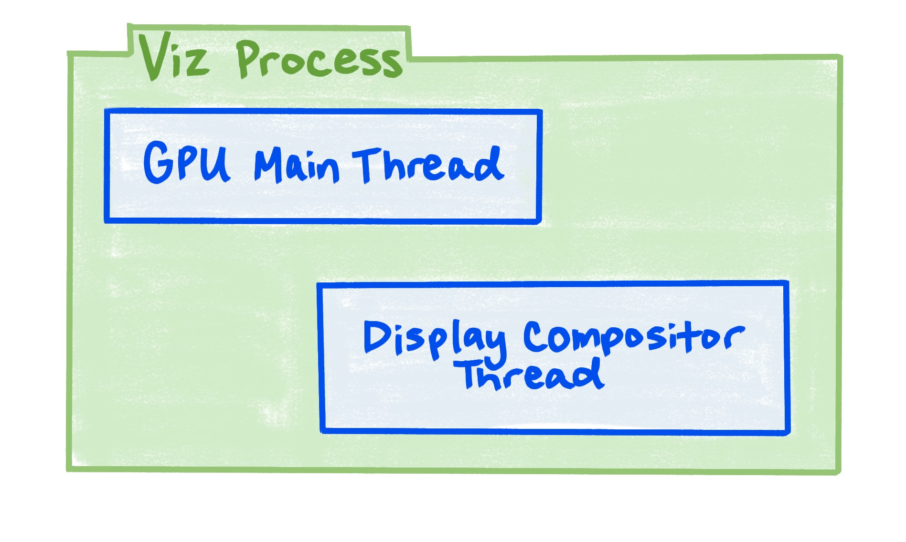

[[toc]]

> 本文是对[这篇文档](https://developer.chrome.google.cn/docs/chromium/renderingng-architecture?hl=zh-cn)的一个总结

## 渲染任务

在渲染过程中主要的核心任务包括：

- 将内容渲染为屏幕上的像素

- 处理页面中的**视觉效果**

- 处理页面**滚动**

- 将输入输送到正确的位置

  将输入事件（如点击、触摸）有效地输送到对应的 DOM 元素，供开发者脚本和子系统处理。

需要渲染的**内容**（*Content*）包括浏览器中每个标签页的**框架/帧树**（*Tree of frames*）、**浏览器界面**、以及来自触摸屏、鼠标、键盘和其他硬件设备的一系列**原始输入事件**。

在浏览器当中，“帧”这个概念并不指的是一张图片。一个**帧**（*Frame*）包括：

- DOM
- CSS
- Canvas
- 外部资源，例如图片、视频、字体或 SVG

一个框架/帧是一个 HTML 文档（包括 URL）。一个网页通常有一个顶级框架/帧，以及顶级框架/帧中包含的每个 `iframe` 子框架/帧及其后代。

## 渲染管线结构

渲染管线按任务划分为多个阶段，每个阶段处理特定逻辑。下图说明了整个渲染管线的结构：

绿色：渲染进程中的**主线程**（*Main thread*）

黄色：渲染进程中的**合成器线程**（*Compositor thread*）

橘色：Viz 进程（GPU进程）

这些阶段具体包括：

1. **动画化**（*Animate*）

   根据声明的时间线，更改计算样式并改变属性树（*Property trees*）。

2. **样式化**（*Style*）

   将 CSS 应用于 DOM 中，并生成计算样式（*Computed style*）。

3. **布局**（*Layout*）

   确定元素的几何属性（位置、大小），生成不可变的 *fragment* 树。

4. **预绘制**（*Pre-paint*）

   计算属性树，并按需使任何现有的显示列表（*Display lists*）和 GPU 纹理图块（*GPU texture tiles*）失效。

5. **滚动**（*Scroll*）

   通过修改属性树来更新文档和可滚动 DOM 元素的**滚动偏移量**，得到最终的属性树。

6. **绘制**（*Paint*）

   生成一个显示列表，以描述如何从 DOM 中光栅化 GPU 纹理图块。

7. **提交**（*Commit*）

   将属性树和显示列表复制到**合成器线程**（可以发现在这之前的所有工作基本都是在主线程中进行）。

8. **图层化**（*Layerize*）

   将显示列表分解为一个**合成图层列表**（Composited layer list），以实现独立的光栅化和动画。

9. **光栅、解码以及绘制工作流**（*Raster, decode and paint worklets*）

   将显示列表、编码图像和绘制工作流代码分别转换为 **GPU 纹理图块**。

10. **激活**（*Activate*）

    生成**合成器帧**（Compositor frame），表示如何在屏幕上绘制和定位 GPU 纹理图块以及任何视觉效果，为最后的屏幕绘制做准备。

11. **聚合**（*Aggregate*）

    将所有可见的合成器帧组合成单个全局的合成器帧。

12. **绘制**（*Draw*）

    在 GPU 上执行上一阶段得到的合成器帧，在屏幕上创建像素。

需要注意的是，如果一些阶段是不必要的，那么它们可以被跳过。例如，一些视觉效果动画（`transform`或`opacity`）和滚动可以跳过布局、预绘制和绘制阶段。这也为什么动画化和滚动这两个阶段在图中用黄绿色标记的原因。如果跳过布局、预绘制和绘制阶段便可以获得视觉效果，则完全可以在**合成器线程**上运行它们并跳过主线程。

这也是我们常说的 <u>CSS 动画性能好</u>的原因，因为它们可以在合成器线程中运行。这意味着，如果浏览器在主线程上运行一些开销较大的任务，这些动画可以继续运行，而不会被阻塞。同时也不会触发回流重绘，因为这些阶段被跳过了。

## 进程和线程结构

### CPU 进程

涉及的进程包括：

- **渲染进程**（*Render process*）

  对标签页进行渲染、动画、滚动和输入的处理。

  可以存在**多个**渲染进程。通常来说**一个标签页会对应一个渲染进程**，除非这些标签页之间存在关联关系，例如其中<u>一个标签页打开了另一个标签页，且两个标签页都属于同站点，那么它们可以共享渲染进程</u>。在内存压力大的情况下，也可能会将来自同一站点的多个标签页放入同一渲染进程中，即使这些标签页之间没有关联也是如此。

  在单个标签页中，不同网站的帧（*Frame*）始终位于不同的渲染进程中，但来自同一站点的帧始终位于同一渲染进程中。这样做的目的是实现跨站点的 `iframe` 和标签页之间的**性能隔离**。这意味着，跨站点 `iframe` 的性能问题不会为当前站点的渲染造成影响。

- **浏览器进程**（*Browser process*）

  对浏览器界面（包括地址栏、标签页标题和图标）和动画效果进行渲染，并且负责将所有剩余输入输送到正确的渲染进程中。

  只有**一个**浏览器进程。为什么只有一个浏览器进程？原因是，系统一次只会聚焦于其中一个标签页。其他不可见的标签页大多处于停用状态，并会丢弃其所有 GPU 内存。

- **Viz 进程**（*Viz process*）

  聚合来自多个渲染进程和浏览器进程的合成内容。

  只有**一个** Viz 进程，因为通常只有一个 GPU 和屏幕可供绘制。将可视化分离到独立进程中，有助于在 GPU 驱动程序或硬件中出现 bug 时提高稳定性。

### 渲染进程

渲染进程主要包括三类线程：

- **主线程**（*Main thread*）

  负责**运行脚本、管理事件循环**、文档生命周期、命中测试、脚本事件调度以及 HTML、CSS 和其他数据格式的**解析**。

  - 主线程辅助线程（*Main thread helpers*）：生成需要编码或解码的图像位图（*bitmap*）和二进制数据（*Blob*）。
  - Web Workers

  每个渲染进程只有**一个**主线程，即使同一网站的多个标签或 `frame` 可能最终出现在同一渲染进程中。然而，在各种浏览器 API 中执行的工作是有性能隔离的。例如，Canvas API 中图像位图和 Blob 的生成在一个主线程辅助线程中运行的。

- **合成器线程**（*Compositor thread*）

  负责处理**输入事件**、对页面内容的**滚动**和视觉效果**动画**处理、对页面内容进行图层化处理，并负责光栅、图片解码以及绘制工作流任务。

  - 合成线程辅助线程（*Compositor thread helpers*）：用于协助可视化光栅任务，并执行图片解码、绘制工作流和回退光栅。

  每个渲染进程只有**一个**合成器线程。一般来说，只有一个并不是问题，因为合成器线程上所有**真正昂贵的操作**都被委托给合成器工作线程（*Compositor worker threads*）或 Viz 进程，而且这些工作可以与输入事件、滚动或动画并行进行。

  合成器工作器线程会协助在 Viz 进程中运行的任务。合成器工作线程的数量取决于设备的能力。

- **媒体、解复用器或者音频输出线程**（*Media, demuxer or audio output threads*）

  对视频和音频流进行解码、处理和同步。**视频线程与主渲染管线并行执行**。

渲染进程中的线程架构是三种不同优化模式的应用：

- **辅助线程**：将**耗时任务**的子任务发送给其他线程，以保持父线程对同时发生的其他请求的响应。主线程的辅助线程和合成器的辅助线程就是这种技术的很好示例。
- **多重缓冲**：在渲染新内容的同时显示以前渲染的内容，以**隐藏渲染的延迟**。合成器线程便采用了这个技术。
- **流水线并行处理**：在页面的多个位置同时进行渲染管线。这就是滚动和动画能够快速运行的原因：即使主线程正在进行渲染更新，滚动和动画也可以并行运行。

### 浏览器进程

- **渲染和合成器线程**（*Render & Compositor thread*）

  负责布局和绘制浏览器界面，响应浏览器界面中的输入，将其他输入输送到正确的渲染进程。

- **渲染和合成器辅助线程**（*Render & Compositor thread helper*）

  负责执行图片解码任务，并回退到光栅化。

浏览器进程中的渲染和合成器线程与渲染进程中的类似，但主线程和合成器线程合并为一个线程。在这种情况下，只需要一个线程，因为不需要与长时间运行的主线程任务隔离性能，因为设计上没有任何长时间运行的主线程任务（因为浏览器进程并不向用户开放）。

### Viz 进程

- **GPU 主线程**（*GPU main thread*）

  将显示列表和视频帧光栅化到 GPU 纹理图块，并将合成器帧绘制到屏幕上。

- **显示合成器线程**（Display compositor thread）

  聚合并优化来自**每个渲染进程**以及浏览器进程的合成信息，并将其合并到单个全局的合成器帧中，以便呈现到屏幕上。

光栅化和绘制通常在GPU 主线程中进行，因为它们都依赖于 GPU 资源，并且很难可靠地多线程使用 GPU。

显示合成器作为一个独立线程，因为它需要始终响应，保证不会被 GPU 主线程上可能导致速度变慢的原因影响。GPU 主线程运行速度慢的主要原因在于调用了非 Chromium 代码（例如特定供应商的 GPU 驱动程序），这些代码的速度可能很慢，难以预测。