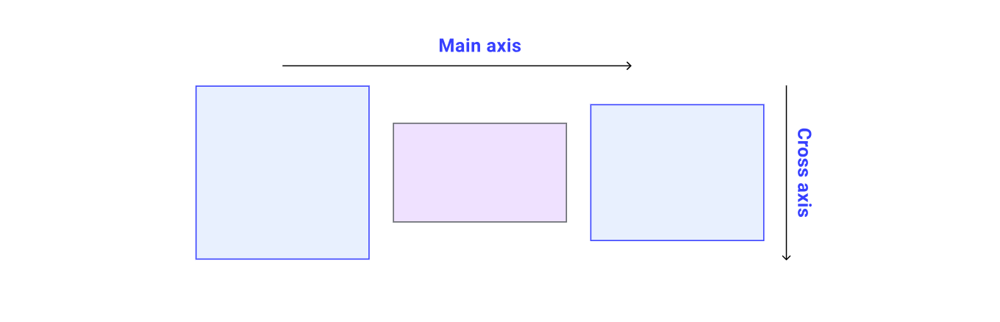
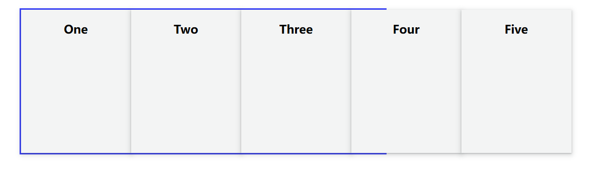
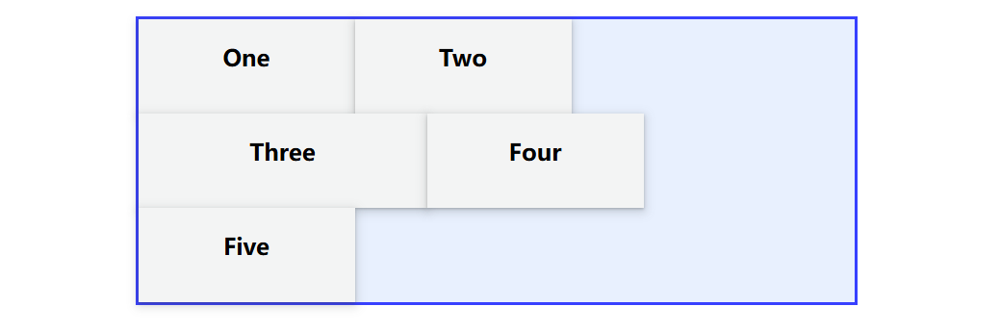
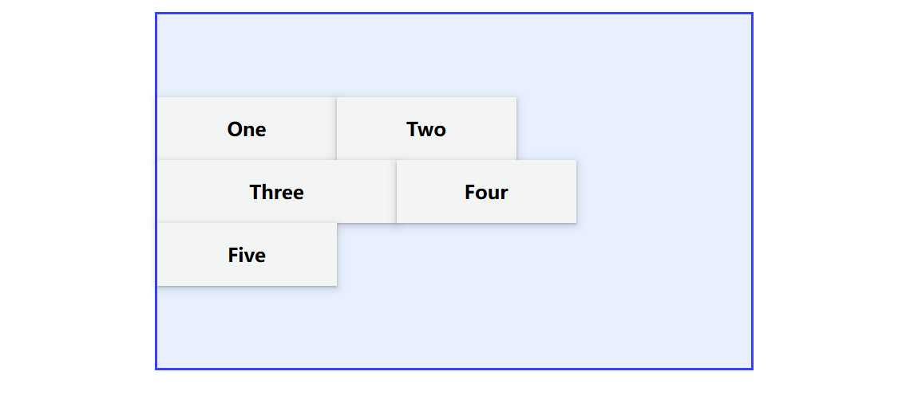
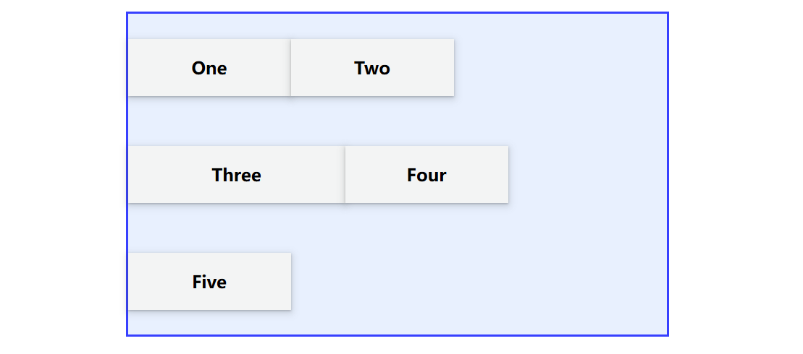
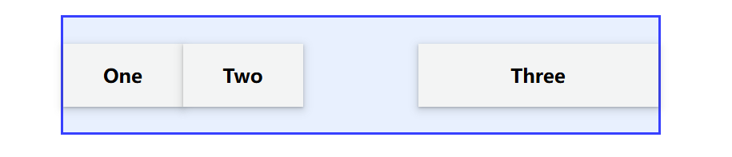
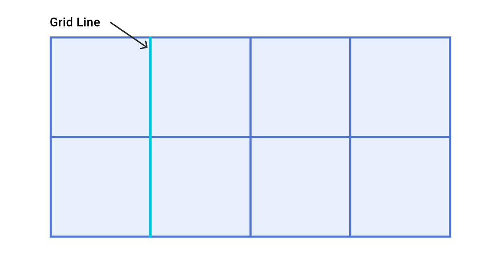
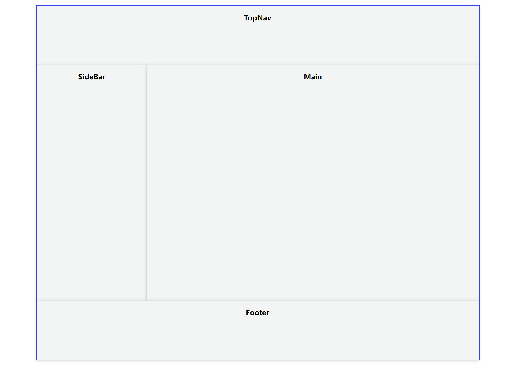
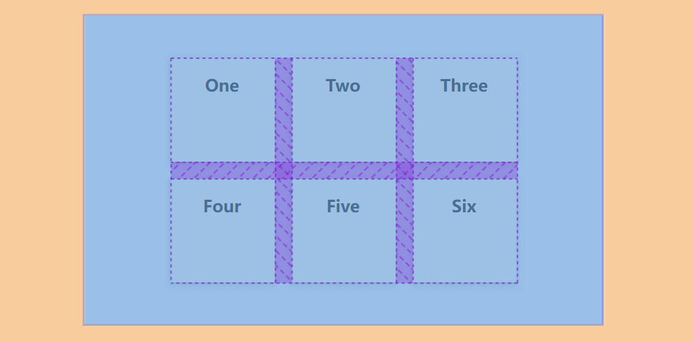
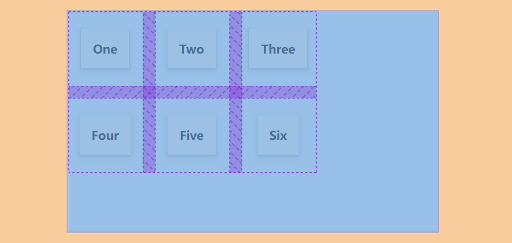

[[toc]]

## Flex 布局

Flexible Box 模型，通常被称为 flexbox，是一种**一维**的布局模型。我们说 flexbox 是一种一维的布局，是因为一个 flexbox <u>一次只能处理一个维度上的元素布局</u>，**一行或者一列**。

### 主轴和交叉轴



通过设置容器的 `flex-direction` 可以调整主轴的方向，主轴的方向决定了**元素排列的方向**，而交叉轴垂直于主轴。

### 换行

`flex-wrap` 属性的初始值为 `nowrap`。 这意味着，如果容器中没有足够的空间，且子元素的 `flex-shrink: 0`，那么子元素就会溢出。



虽然 flexbox 是一种一维的布局，但我们可以通过设置容器的 `flex-wrap: wrap`，这样原本会溢出的子元素就会另起一行。



在空间分配角度来看，每行都像一个新的 Flex 容器。因此，后续行中的内容不可能可以与上一行中的内容**对齐**。 这就是 flexbox 是**一维**的意思。 我们可以控制<u>一个轴（行或列）中的对齐方式，但不能同时控制这两个轴</u>。

### Flex-flow 简写形式

可以使用简写形式 `flex-flow` 同时设置 `flex-direction` 和 `flex-wrap` 属性。

```css
.container {
    display: flex;
    flex-flow: column wrap;
}
```

### Flex  元素上的属性

为了更好地控制 flex 子元素，有三个属性可以作用于它们：

- [`flex-grow`](https://developer.mozilla.org/zh-CN/docs/Web/CSS/flex-grow)

  1. `flex-grow` 属性决定了容器在主轴方向上还有**剩余空间**时，如何分配这些剩余空间。这会使该元素延展，并占据此方向轴上的可用空间。如果有其他元素也被允许延展，那么他们会各自占据可用空间的一部分。
  2. `flex-grow` 属性可以按比例分配空间。如果一共有三个子元素，第一个元素 `flex-grow` 值为 2，其他元素值为 1，则第一个元素将占有 $\frac{2}{4}$，另外两个元素各占有 $\frac{1}{4}$。
  3. 但如果所有子元素的 `flex-grow` 之和**小于 1** 时，那么分母将会使用 1 来参与计算，而不论它们的和是多少。也就是说，当所有的元素的 `flex-grow` 之和小于 1 的时候，剩余空间不会全部分配给各个元素。

  **注意**：如果最终分配的结果大于 `max-width` 指定的值，`max-width` 的值将会优先使用。

- [`flex-shrink`](https://developer.mozilla.org/zh-CN/docs/Web/CSS/flex-shrink)

  1. `flex-shrink` 属性决定了容器在主轴方向上**没有空间**分配给子元素时，如何收缩这些子元素。
  2. `flex-shrink` 收缩大小的计算方式与 `flex-grow` 不同，详细可看 https://zhuanlan.zhihu.com/p/24372279。

  **注意**：如果最终收缩的结果小于 `min-width` 指定的值，`min-width` 的值将会优先使用。

- [`flex-basis`](https://developer.mozilla.org/zh-CN/docs/Web/CSS/flex-basis)

  1. `flex-basis` 属性设置子元素在主轴上的初始大小。该值可以是一个相对于其父弹性盒容器主轴尺寸的百分数。

  **注意**：当一个元素同时被设置了 `flex-basis` (除值为 `auto` 外) 和 `width` (`height`) , `flex-basis` 具有更高的优先级。

通过简写属性 `flex: flex-grow flex-shrink flex-basis` 可以同时设置以上三个属性。其中 `flex: 1` 表示 `flex: 1 1 0`，`flex: auto` 表示 `flex: 1 1 auto`。

### 对齐

在 flexbox 中，对齐主要分为两类——空间分布方式和子元素对齐方式。空间分布指的是调整子元素周围的空间分布来达到对齐的效果。

- 空间分布方式
  1. `justify-content`：设置容器内子元素在主轴上的空间分布。
  2. `align-content`：设置容器内子元素在交叉轴上的空间分布。
  3. `place-content`：是以上两者的简写形式。
- 子元素对齐方式
  1. `align-self`：设置**子元素**在交叉轴上的对齐方式。因此，该属性是在 flex 子元素上设置的。
  2. `align-items`：设置**容器内所有子元素**在交叉轴上的对齐方式。因此，该属性是在 flex 容器上设置的。

这里我们再详细讲讲空间分布方式，例如对于 `align-content: center` 而言，表明的是<u>容器的交叉轴的起始位置和第一行（列）的距离相等于容器的交叉轴的终点位置和最后一行（列）的距离</u>，这就是为什么叫空间分布方式，我们操作的其实是容器的整个空间分布从而达到子元素对齐的效果。因此，空间分布方式仅在有剩余空间可供分配时才有效。



而对于 `align-items: center` 而言，表明的是 flex 子元素在交叉轴上居中对齐，这才是我们通常认为的对齐。



### 为什么 Flexbox 中没有 "justify-self"

因为 Flex 布局是一种一维布局方式，它强调的是容器内元素作为一个整体在主轴和交叉轴方向上的对齐和分布方式。

> 因此，在二维布局方式 `grid` 中便可以设置 `justify-self` 和 `justify-items`。

但我们可以通过在 flex 布局中结合自动边距 `margin` 来实现主轴的单个对齐方式。例如，现有三个元素，我们要使得右边的第三个元素水平靠右对齐，那么可以设置第三个元素的 `margin-left: auto` 即可实现。



## Grid 布局

Grid 布局又称网格布局，属于**二维**布局方式，即可以控制子元素在行和列两个维度上的布局。Grid 布局带来的最大好处就是在一些场景下，通过 Grid 布局就可以实现响应式布局，而无需任何媒体查询。

### 显示网格

我们可以通过两个属性来显示地设置网格的布局：

- `grid-template-columns`：该属性设置每个网格在列上的大小，可以设置多个值，表示多个网格在列上依次的大小。

  例如，`grid-template-columns: 100px 200px 100px` 表示一共三列，在列方向上的长度分别为 100px、200px 和 100px。

- `grid-template-row`：该属性设置每个网格在行上的大小，可以设置多个值，表示多个网格在行上依次的大小。

更重要地是，在这两个属性的取值中引入了新的长度单位和函数：

- `fr` 单位：类似于 flex 布局中的 `flex-grow`，表示元素按比例分配剩余的空间。

- `minmax()` 函数：该函数可以传入两个值，分别表示网格大小的下限和上限。

- `repeat()` 函数：该函数可以传入两个值，分别表示重复的次数和网格的大小。

  在该函数中第一个值还可以取 `auto-fill` 和 `auto-fit`。`auto-fill` 表示如果网格在相关轴上具有**确定的大小**或**最大大小**，那么重复的次数即为对应轴上的 $\lfloor 网格大小 / 容器大小 \rfloor$。而 `auto-fit` 与 `auto-fill` 类似，只是在具有剩余空间时，`auto-fit` 的网格会自动填充剩下的空间。

利用以上这三个新单位和函数，我们可以在 Grid 布局下很方便地实现响应式布局：

```css
grid-template-columns: repeat(auto-fill, minmax(200px,1fr));
```

<video src="./20241103152408.mp4" autoplay loop muted playsinline/>

### 排列顺序

通过设置 `grid-auto-flow` 来改变排列顺序。

- `row`：该关键字指定自动布局算法按照通过逐行填充来排列元素，在必要时增加新行，即元素是**按列排列**。
- `column`：该关键字指定自动布局算法通过逐列填充来排列元素，在必要时增加新列，即元素是**按行排列**。
- `dense`：该关键字指定自动布局算法使用一种“**稠密**”堆积算法，如果后面出现了稍小的元素，则会试图去填充网格中前面留下的空白。这样做会填上稍大元素留下的空白，但同时也可能导致原来出现的**次序被打乱**。

### 放置子元素

我们可以通过 `grid-column` 和 `grid-row` 这两个属性来设置子元素在网格中的所占的大小（位置）。

- `grid-column`：是 `grid-column-start` 和 `grid-column-end` 的简写属性。用于表示子元素在网格中列方向上的起始位置和终止位置。
- `grid-row`：是 `grid-row-start` 和 `grid-row-end` 的简写属性。用于表示子元素在网格中行方向上的起始位置和终止位置。

这里的位置指的是第几个网格基线（line），例如 `1` 表示是网格的第一个基线，`-1` 表示最后一个基线，即基线是序号是从左到右，从上到下的。



现在我要写一个页面，它包含了顶部导航栏、侧边栏、右侧主要内容、底部信息栏，采用 Grid 布局实现便需要利用这两个属性来实现：

```html
<div class="wrapper">
    <div class="box TopNav">TopNav</div>
    <div class="box SideBar">SideBar</div>
    <div class="box Main">Main</div>
    <div class="box Footer">Footer</div>
</div>

<style>
    .wrapper {
        display: grid;
        grid-template-columns: repeat(4, 1fr);
        grid-template-rows: repeat(6, 1fr);
    }
    .SideBar {
        grid-row: 2 / -2;	// [!code highlight]
    }
    .TopNav {
        grid-column: 1 / -1;	// [!code highlight]
    }
    .Main {
        grid-column: 2 / -1;	// [!code highlight]
        grid-row: 2 / -2;	// [!code highlight]
    }
    .Footer {
        grid-column: 1 / -1;	// [!code highlight]
    }
</style>
```



对于 `grid-row` 需要注意的是，如果设置为负数时，需要确保行方向上的网格是**显示设置**的，否则该属性设置会失效。

### 隐式网格

之前我们说到使用 `grid-template-rows` 和 `grid-template-columns` 创建网格时可以创建所谓的“显式网格”。而“隐式网格”即指的是**没有使用** `grid-template-rows` 和 `grid-template-columns` 来指定大小，此时则会创建一个隐式的网格轨道来支撑子元素；对于**超出显示设置个数的元素**或使用 `grid-column-end` 将某个子元素**放置在定义的显式网格之外**也会创建一个隐式的网格。

这里提到一个概念——轨道，简单来说就是网格中的一行或者一列就是一个轨道。

我们可以通过 `grid-auto-column` 和 `grid-auto-row` 来设置隐式创建的列（行）轨道的大小，这两个属性的设置和显示网格类似，但没有 `repeat` 函数。

### 网格模板区域

我们还可以为网格的区域命名，并将子元素放置在这些命名区域中。

还是以刚刚的例子为例，我们可以为每个部分的元素设置属性 `grid-area`，表明每个子元素将放置在对应的区域名：

```css
.SideBar {
    grid-area: sidebar;
}
.TopNav {
    grid-area: header;
}
.Main {
    grid-area: main;
}
.Footer {
    grid-area: footer;
}
```

然后，我们为容器设置 `grid-template-areas`，即网格模板区域，为每个区域命名（当然，前提要先显示设置网格），每一个引号表示一行轨道：

```css
grid-template-columns: repeat(4, 1fr);
grid-template-rows: repeat(6, 1fr);
grid-template-areas:
    "header header header header"
    "sidebar main main main"
    "sidebar main main main"
    "sidebar main main main"
    "sidebar main main main"
    "footer footer footer footer";
```

这样也可以实现一样的效果，而且更加简便。

如果我们要在网格中留出空白，可以使用 `.`，可以使用一个或多个来表示，若多个它们之间必须没有空格。

注意，使用 `grid-template-areas` 时需要遵循一些规则，若不满足以下规则，则会失效：

- 轨道中一旦有一个网格被命名，则该轨道的所有网格必须全部命名。
- 通过重复名称创建的区域必须为矩形，且**不能断开连接**。

### 对齐

Grid 布局使用的对齐属性与 Flex 布局相同，并且多了两个属性 `justify-self` 和 `justify-items`。由于 Grid 布局没有主轴和交叉轴的概念，这里的 `justify-` 指的是列方向，`align-` 指的是行方向。

而且在 Grid 布局中我们可以更加直观的理解 `-content` 和 `-items` 的区别，下图是 `justify-content` 和 `align-content` 都为 `center` 的情况：



下图则是 `justify-items` 和 `align-items` 都为 `center` 的情况：



