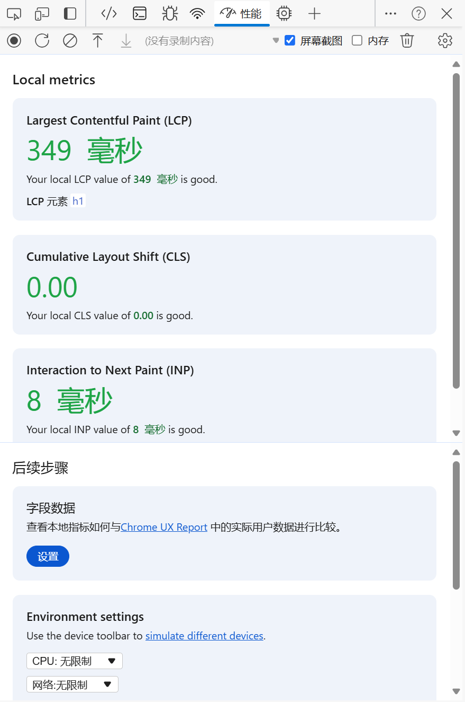
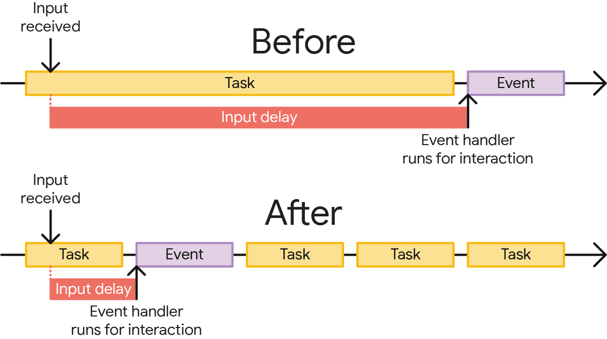
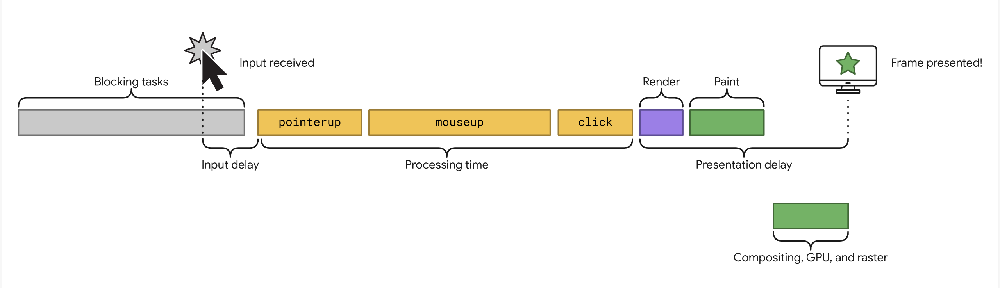
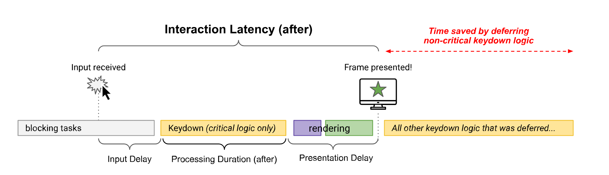

[[toc]]

在今年 5 月份，Chrome 团队[正式替换了 First Input Delay (FID)](https://web.developers.google.cn/blog/inp-cwv-launch?hl=zh-cn#fid_deprecation_timeline)，改用了 Interaction to Next Paint (INP) 作为衡量互动响应能力的核心网页指标。这意味着，Chrome 工具将不再提供 FID，开发者必须在 **2024 年 9 月 9 日**之前过渡到 INP。

在开发者工具中的性能板块也发生了变化，现在可以直接看到页面的 LCP、CLS 和 INP 了，不用像之前那样需要开启屏幕录制后才能获取这些指标。



那今天我们来看看什么是 FID 和 INF。

## First Input Delay (FID)

First Input Delay (FID)，又叫作首次**输入延迟**，是指从用户首次与页面互动（例如点按屏幕、使用鼠标或按下按键）开始，一直到互动事件回调**开始运行**的时间段。


输入延迟的某些部分是不可避免的：<u>操作系统总是需要一些时间才能识别输入事件并将其传递给浏览器</u>。不过，这部分输入延迟通常并不明显，而网页上发生的其他情况可能会导致输入延迟过长，从而出现“卡顿”问题。具体地说，就是用户在触发事件时，主线程正在执行其他的任务，导致事件触发的回调函数被延后执行。

一种解决办法，就是避免主线程执行耗时较长的任务。如果在交互过程中有过多的任务阻塞主线程，那么长任务还没来得及完成，就会增加输入延迟。因此，我们可以通过[分解冗长的任务](https://web.developers.google.cn/articles/optimize-long-tasks?hl=zh-cn)来降低长任务导致的输入延迟。



### 分解长任务

那如何来分解一个长任务呢？

首先，我们需要对任务进行阶段性的划分，尽可能地把一个长任务中**互相独立**的任务分离出来，得到多个子任务。

例如，对于一个提交表单的功能，这个任务可以划分成：验证表单、显示加载图标、将数据发送到应用后端、更新界面这四个子任务。

```js
function saveSettings () {
    validateForm()
    showSpinner()
    saveToDatabase()
    updateUI()
}
```

但仅仅划分不同的子任务来执行一整个长任务并不会让主线程将每个函数作为单独的任务运行，因为它们是在 `saveSettings()` 函数中执行的。也就是说，**这四个函数都将作为一个任务运行**。

因此，我们要借助事件循环机制，利用 `setTimeout` 和 `async/await` 来实现。我们都知道，延时器可以开启一个新的宏任务，那么我们可以在每次执行一个子任务后，通过 `await`  一个 `Promise` ，该 `Promise` 对象会在执行一个延时器后兑现。这样就可以使得这些子任务在不同的阶段去执行，主线程不会因为执行太长的任务而不能响应用户的事件交互。

```js
function yieldToMain () {
    return new Promise(resolve => {
        setTimeout(resolve, 0)	// [!code highlight]
    })
}

async function saveSettings () {
    const tasks = [
        validateForm,
        showSpinner,
        saveToDatabase,
        updateUI
    ]

    while (tasks.length > 0) {
        const task = tasks.shift()
        task()
        await yieldToMain()	// [!code highlight]
    }
}
```

## Interaction to Next Paint (INP)

Interaction to Next Paint (INP)，指的是**用户交互距离下一次页面渲染**的时间。更简单来讲，用户在与页面进行交互时，我们要尽可能快地给用户一些*视觉反馈*，以告知用户他的操作是**有效**的，页面在响应他的操作。

在以下视频中，右侧的示例会立即提供视觉反馈，表明该折叠式风琴正在打开。如左侧示例所示，响应能力很差，导致糟糕的用户体验。

<video src="./WSmcjiQC4lyLxGoES4dd.mp4" autoplay loop muted playsinline/>

相对于 FID 而言，INP 是一个更加以**用户体验为中心**的指标。而且我们可以发现，FID 其实是 INP 的一个子集。在事件回调函数开始运行之前，会发生输入延迟。然后，系统会运行事件的回调函数，最后到浏览器绘制下一个帧。



INP 只考虑以下几个交互类型：

- 鼠标点击
- 触摸设备上的点按
- 实体键盘或屏幕键盘上的按键

### 优化 INP

想要缩短 INP 花费的时间，主要可以从三个方面进行优化：

1. 输入延迟。在用户发起与网页的互动时开始，在互动的事件回调开始运行时结束。
2. 处理时长。即事件回调完成运行所需的时间。
3. 呈现延迟。即浏览器呈现交互视觉结果的下一帧所用的时间。

这三个方面的总和就是 INP 花费的时间，三个方面对应 INP 的三个阶段，每个阶段都会带来一定程度的延迟时间。

对于**第一个阶段**，我们在上一节已经提到如何优化。

而对于**第二个阶段**，优化思路本质上与第一个阶段是类似的。回调处理的执行时间如果不能够进一步优化，我们可以按照之前处理长任务的方法，将回调函数分解为多个子任务，但我们**优先执行那些对视图更新的任务**，而用户看不见的逻辑处理任务我们可以延后执行。这样就可以使得渲染逻辑能够更快地运行。



对于**第三个阶段**，这部分的延迟取决于我们整个 DOM 树的大小。DOM 树越庞大，那么重新渲染需要花费的时间可能就会越长。渲染工作和 DOM 大小之间的关系不是线性的，但与小型 DOM 相比，大型 DOM 确实需要更多的工作来进行渲染。这个阶段我们能做的优化工作其实很少，只能在编码过程中注意，例如避免存在不必要的标签，避免过深的 DOM。

这里提一个在 ***BaseLine 2024*** 中提出的新的 CSS 属性——`content-visibility` ，它可以控制元素是否渲染，这实际上是一种延迟渲染屏幕外 DOM 元素的方式。当这些元素接近视口时，它们便会按需呈现。类似于图片中采用的懒加载，但通过这个属性我们可以实现 DOM 元素的懒加载。`content-visibility` 的优势不仅可在网页首次渲染时省去大量的渲染工作，而且<u>当页面 DOM 因用户互动而发生变化时，还能跳过**屏幕外元素**的渲染工作。</u>
