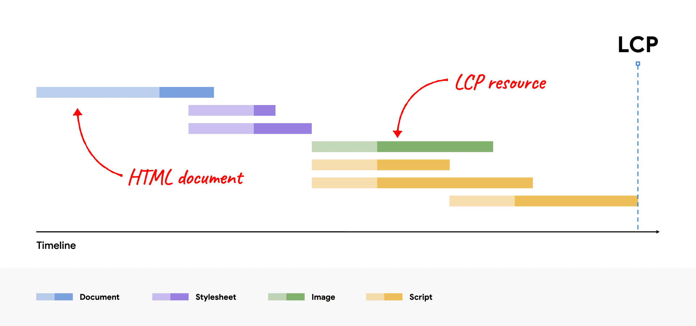
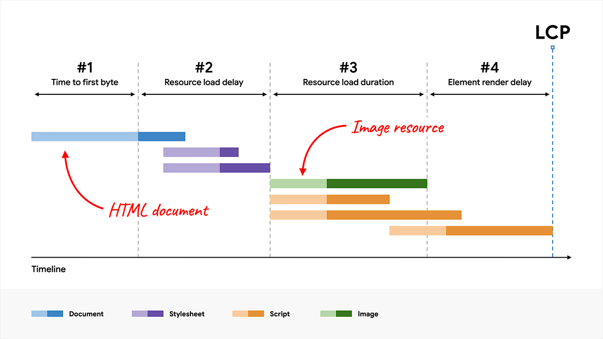
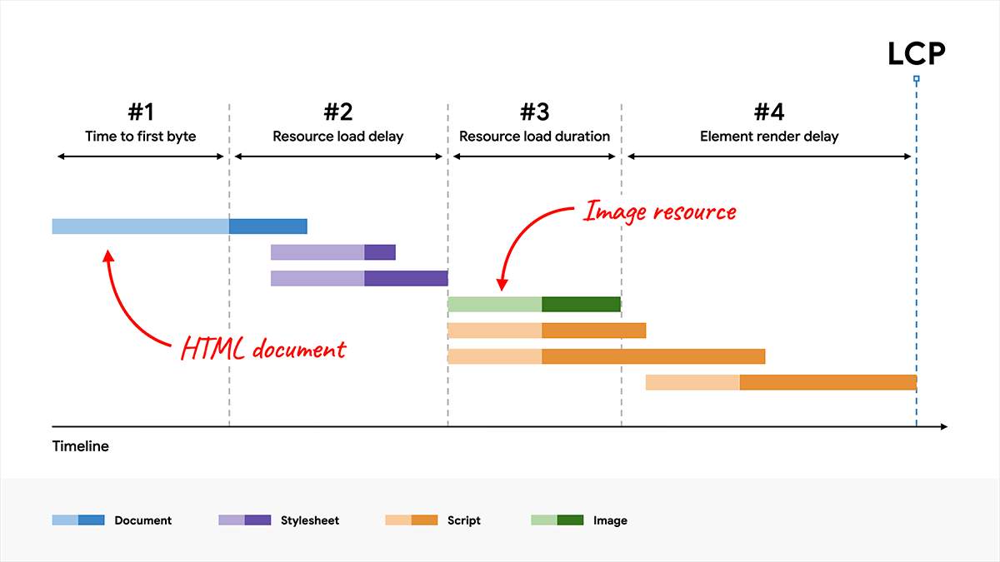
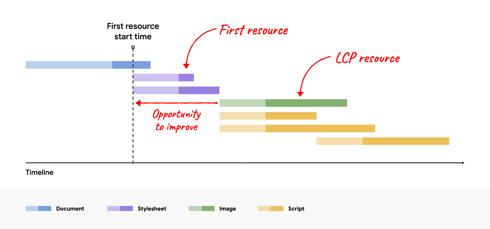
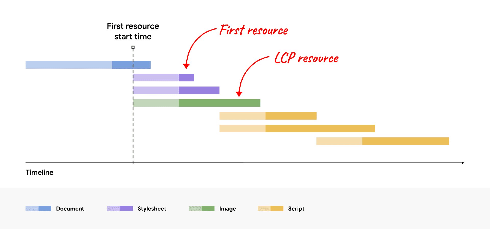

[[toc]]

在之前的博客中其实介绍过了相关的 Web 性能优化方法，但个人认为这种总结方式以及方法论缺乏目标和系统性。因此，本文重新审视 Web 中的性能优化方法，系统性地总结应该如何对 Web 项目进行性能优化。

## 性能指标

在进行性能优化前，你需要明确的是，如何衡量这个项目的“**性能**”？换句话说，你要如何去量化项目的性能，从而根据这个指标来进行针对性地优化。那么通常我们会根据一些常用的指标，例如 Google 团队提出的以用户体验为中心的 [Core Web Vitals](https://web.developers.google.cn/articles/vitals?hl=zh-cn#core_web_vitals) 指标，包括 *LCP*、*CLS*、*INP* ，除此之外其他的部分指标在[之前的文章](https://tailwind144.github.io/my-house/page/event-tracking#%E6%80%A7%E8%83%BD%E6%95%B0%E6%8D%AE%E9%87%87%E9%9B%86)中我也做了简单的概念介绍。

不同的指标针对的性能特征也有所不同：

- **感知的加载速度**：网页将其所有视觉元素加载并呈现到屏幕上的速度。例如 *Largest Contentful Paint (LCP)*。
- **加载响应能力**：网页加载和执行任何所需 JavaScript 代码的速度，以便组件快速响应用户互动。例如 *Time to Interactive (TTI)*。
- **运行时响应速度**：网页加载后，网页对用户互动的响应速度。例如 *Interaction to Next Paint (INP)*。
- **视觉稳定性**：网页上的元素是否以用户意料之外的方式移动，并可能会干扰用户互动？例如 *Cumulative Layout Shift (CLS)*。
- **流畅度**：转场效果和动画是否以一致的帧速率呈现，并且从一个状态流畅地过渡到下一个状态？

**不同类型的产品对不同指标的需求天差地别**，而不同的指标其优化手段自然也会因此不同，所以你需要明确的是我要优化的是哪个“性能”？

指标数据的采集主要来自两个方面：一个是实验数据，即在可控的环境中测试，例如 Lighthouse。这种形式无法完全代表真实用户的多样性（设备、网络、地理位置），但这是功能正式发布前的唯一测试方式；另一个则是**真实用户监控 (RUM - Real User Monitoring)**，通过埋点在用户浏览器中收集性能数据。

指标的优化总有极限，因此我们还要看到的是，**指标的优化为业务带来了多少收益**？这才是我们优化性能的*最终目标*——提高转化率、用户留存率等等。因此，这里我就不对各种指标做详细地介绍，我想要说明的是在进行性能优化前，你一定要明确你的目标。

接下来，我会以 *Largest Contentful Paint (LCP)* 为例，说明在优化指标时需要考虑哪些方面以及相应的优化方法。

## 优化 Largest Contentful Paint

*LCP* 衡量的是*从用户发起网页加载到视口中渲染最大内容所用的时间*。Google 团队认为网站应尽量将 *LCP* 控制在 **2.5 秒**或更短的时间内，以提供良好的用户体验。以下是 *LCP* 指标计算会考虑的元素：

- `` 元素（[第一帧呈现时间](https://chromium.googlesource.com/chromium/src/+/refs/heads/main/docs/speed/metrics_changelog/2023_08_lcp.md)适用于 GIF 或动画 PNG 等动画内容）。
- `<svg>` 元素中的 `<image>` 元素。
- `<video>` 元素（使用 `poster` 海报图片加载时间或视频的[第一帧呈现时间](https://chromium.googlesource.com/chromium/src/+/refs/heads/main/docs/speed/metrics_changelog/2023_08_lcp.md)，以较早的为准）。
- 使用 `url()` 函数加载背景图片的元素（而不是 CSS 渐变）。
- 包含文本节点或其他内嵌级文本元素子元素的块级元素。

除了仅考虑某些元素之外，*LCP* 还会使用启发词语来排除用户可能会视为“无内容”的某些元素，例如：

- 不透明度为 0 且对用户不可见的元素。
- 覆盖整个视口的元素，可能被视为背景而非内容。
- 占位图片，可能无法反映网页的真实内容。

因此，要优化 *LCP* 指标，你需要先找出项目中哪个元素是 *LCP* 元素，你可以通过 Lighthouse 来帮助你找到 *LCP* 元素。然后，在开发者工具网络模块的网络瀑布图中找到 *LCP* 资源请求所在的位置：



我们希望 *LCP* 资源请求尽早开始加载，并且希望 *LCP* 元素在 *LCP* 资源加载完成后尽快渲染呈现。为了进一步明确其他资源对 *LCP* 资源的阻塞影响，我们将总 *LCP* 时间细分为以下的子部分：

1. **加载第一个字节的时间 (TTFB)**

   从用户发起网页加载到浏览器收到 HTML 文档响应的第一个字节的时间。

2. **资源加载延迟**

   TTFB 与浏览器开始加载 *LCP* 资源之间的时间。如果 *LCP* 元素不需要资源加载即可呈现（例如，如果该元素是使用系统字体呈现的文本节点），则此时间为 0。

3. **资源加载时间**

   加载 *LCP* 资源本身所需的时间。如果 *LCP* 元素不需要网络加载（base64格式）即可呈现，则此时间为 0。

4. **元素渲染延迟**

   从 *LCP* 资源完成加载到 *LCP* 元素完全渲染之间的时间。

> 注意“**延迟**”和“**时间**”这两个不同的概念。



需要注意的是，我们通常需要优化每个子部分才能达到优化指标的目的。因为在某些情况下，对某个子部分应用的优化不会改善 *LCP*，只会将节省的时间转移到另一个子部分。

以前面的网络瀑布流为例，如果通过更高压缩率或改用更优化的格式（例如 AVIF 或 WebP）来缩减图片的文件大小，这会缩短**资源加载时长**，但实际上并不会改善 *LCP*，因为节省的时间只会转移到**元素渲染延迟**上：



很显然，此时的 *LCP* 时间由最晚完成加载的 JavaScript 资源来决定，这导致我们所采用的优化并没有实际缩短 *LCP* 时间。因此，我们需要优化所有这些子部分，才能取得最佳的 *LCP* 效果。

### 优化加载第一个字节的时间（TTFB）

此阶段的目标是**服务端尽快提供入口 HTML 文档**。该阶段作为整个 *LCP* 的第一个阶段，在服务端传送第一字节之前，客户端无法执行任何操作，因此缩短 TTFB 时间可以直接改善 *LCP* 指标。

导致网站 TTFB 较慢的一个常见原因是，用户是通过多次重定向（例如通过广告或[缩短链接](https://en.wikipedia.org/wiki/URL_shortening)）来访问的。你应该尽可能减少用户必须等待的重定向次数。

另一个常见原因是，CDN 无法使用缓存的内容，并且所有请求都必须一直转回源服务器，这延长了第一个字节的传输时间。如果用户使用唯一网址参数进行访问，就可能会出现这种情况，即使这些参数不会导致网页不同也是如此。

其次，如果你的项目采用了 SSR 渲染，服务端需要提前创建 DOM 元素到入口 HTML 文档中，这会直接延长 TTFB 时间。不过，这种权衡通常是值得的，因为服务器的处理时间在我们的控制范围之内，而用户的网络和设备不是。另外，SSR 渲染也能缩短元素渲染的延迟时间。

### 优化资源加载延迟

此阶段的目标是**确保 *LCP* 资源尽早地开始加载**。虽然在理论上，资源最早可以在 TTFB 后立即开始加载，但在实践中，浏览器实际开始加载资源之前总会有一些延迟。

一般来说，*LCP* 资源与网页加载的第一个资源应该同时开始加载。换句话说，*LCP* 资源的开始加载的时间不能晚于其他资源，如果有则说明存在改进的空间。



一般来说，主要有两个因素会影响 *LCP* 资源的开始加载的时间：

1. **发现资源的时间**

   浏览器的预加载扫描器能够在入口 HTML 文档中提前发现资源，从而发起请求进行加载。所以，如果你的 *LCP* 元素存在以下情况，则是无法被扫描发现的：

   - *LCP* 元素是 `` 图片，通过 JavaScript 动态添加到网页中。
   - *LCP* 元素是通过 `data-src` 或 `data-srcset`（元素没有 `src` 或 `srcset` 属性）懒加载的元素。
   - *LCP* 元素是 CSS 背景图片（ CSS 背景图片[无法被浏览器预加载扫描器发现](https://web.developers.google.cn/articles/preload-scanner?hl=zh-cn#css_background_images)），且没有在 HTML 文档中使用 `<link rel="preload">`预加载的。

   只要你的 *LCP* 元素是**静态**的，那么通常来说它就可以被预加载扫描器提前发现，并在 TTFB 之后立即开始加载该资源。否则，如果 *LCP* 元素需要先运行 JavaScript  脚本或应用 CSS 样式表，那么这种情况都会延迟资源开始加载的时间。

2. **资源的优先级**

   即使 *LCP* 资源可从 HTML 文档中发现，也可能不会与第一个资源一起开始加载。如果预加载扫描器的优先级启发词语无法识别该资源的重要性，或者认为其他资源更重要，就可能会发生这种情况。因此，你可以通过 [`fetchpriority`](https://web.developers.google.cn/articles/fetch-priority?hl=zh-cn) 属性来设置资源的优先级，直接告诉浏览器哪些资源最重要：

   ```html
   
   ```

   需要注意的是，如果为多张或两张以上的图片设置高优先级，会导致该优先级设置失效。

除了这两个主要因素外，如果你的 *LCP* 资源是**托管在其他来源**（与提供入口 HTML 文档的服务器不相同），则该 *LCP* 请求还需要浏览器先连接到该来源，然后资源才能开始加载。因此，你应该尽可能在与 HTML 文档资源相同的服务器上托管 *LCP* 资源，这样浏览器就可以复用这个 TCP 连接，在一定程度上消除资源加载的延迟。

通过以上这些优化手段，我们应该得到以下这样的网络请求瀑布流：



### 优化资源加载时间

此阶段的目标是**减少将 *LCP* 资源通过网络传输到客户端所花费的时间**。我们会从以下这四种角度来优化：

1. **缩减资源的大小**

   对于图片：

   - 提供自适应图片

     **针对不同的设备提供不同尺寸的图片**，对于移动端没有必要传输桌面端系统的尺寸图片。应用不应该提供大于在用户屏幕上呈现的图片版本。超过这个大小的任何内容只会导致字节浪费，并减慢资源加载速度。

     我们可以为每张图片生成多个版本，然后使用媒体查询、视口尺寸等来指定要在 HTML 或 CSS 中使用的图片版本。

   - 采用先进的图片格式

     **WebP 图片**比 JPEG 和 PNG 图片体积小得多，通常文件大小会缩减 25-35%。

     对于 GIF 格式的 *LCP* 元素，可以改为 `<video>` 元素，因为*同等情况下视频格式的资源会比 GIF 的体积更小*。但需要注意的是，没有 [`poster` 图片](https://developer.mozilla.org/docs/Web/HTML/Element/video#attr-poster)的 `<video>` 元素不能成为 *LCP* 元素，因此此时 *LCP* 元素会发生变化，需要根据实际情况考虑。

   - 压缩图片

     根据实际情况，通过工具进行一定程度的有损或无损压缩。

   对于字体：

   - 采用先进的字体格式

     **WOFF 2.0** 的内部压缩使用 Brotli，与 WOFF 相比，压缩率最高可提高 30%。

   以上采用先进格式的优化手段，都需要注意是否需要兜底来兼容低版本浏览器。

2. **减少资源传输的距离**

   要减少资源传输的距离，最佳的优化方式就是采用 **CDN（内容分发网络）**。

3. **减少网络带宽争用**

   服务器的带宽是有限的，如果同时加载许多其他资源，资源仍可能需要较长时间才能加载完毕。因此可以通过之前提到的 [`fetchpriority`](https://web.developers.google.cn/articles/fetch-priority?hl=zh-cn) 属性来阻止优先级较低的资源与 *LCP* 资源竞争。

4. **完全消除网络时间**

   为 *LCP* 资源应用缓存，从而直接消除后续访问该资源时此阶段的时间。

   对于 *LCP* 元素为文本元素的，可以在 `@font-face` 中设置 `font-display` 属性为 `auto` 或 `block` 以外的任何值，那么文本将[在加载期间始终可见](https://developer.chrome.google.cn/docs/lighthouse/performance/font-display?hl=zh-cn)，从而直接消除这部分加载字体资源的时间。

   如果 *LCP* 元素为图片且体积较小的，可以考虑转换为 base64 格式，直接消除资源加载时间。但需要注意的是，虽然消除了资源加载时间，但是浏览器需要对 base64 格式进行解码，可能会导致更长的渲染延迟时间。

### 优化元素渲染延迟

此阶段的目标是**确保 *LCP* 元素在其资源完成加载完成（无论何时）后立即渲染**。*LCP* 元素在其资源完成加载后*无法*立即渲染的主要原因可能有：

- CSS 样式表或 JavaScript 脚本仍在加载，因此整个页面的呈现被阻止。
- *LCP* 资源已加载完毕，但 *LCP* 元素尚未添加到 DOM（正在等待相关的 JavaScript 代码执行）。
- 主线程因**长时间运行的任务**而被阻塞，渲染工作需要等待这些长时间运行的任务完成。

导致的原因可能不止以上三种，在实际项目中，你需要分析你的应用是由于哪种原因导致元素渲染延迟，然后针对性处理。

对于第一点，你可以将部分体积较小的样式表或脚本代码直接内嵌到 HTML 文档中，从而避免发出额外的网络请求，当然这在一定程度上也会增大入口 HTML 文档的体积（所以只将体积较小的内嵌）。其次，就是在构建阶段尽可能的压缩样式表和脚本的体积。

另外，你可以考虑将样式表拆分为初始首屏加载所需的样式，以及可以延迟加载的样式，一定程度减小初始时需要加载的样式体积；同样地，对于部分模块的脚本代码不是首屏所需要的，你也可以考虑延迟加载。具体的实现方法，你可以利用 [`IntersectionObserver`](https://developer.mozilla.org/zh-CN/docs/Web/API/IntersectionObserver) 给可以延迟加载的模块做视口交叉监听，并在回调中通过异步导入的方式引入脚本和样式表，这样只有当用户视口中出现这些模块时，才会去加载这些模块的脚本和样式表。

对于第二点，你可以考虑采用 SSR 服务端渲染，这样在传输给客户端的 HTML 文档中就包含了需要 JavaScript 代码添加的 *LCP* 资源，因为在服务端阶段就完成了这部分的工作。之前我们也提到了，SSR 渲染会延长 TTFB 的时间，其次也会加大服务器的压力，但通常来说这种权衡是值得的。

对于第三点，我们可以分解这些长时间运行的任务，将分解后的子任务在不同的宏任务阶段去执行，从而让出主线程以进行渲染工作，具体的方法我在[之前的文章](https://tailwind144.github.io/my-house/page/interaction-to-next-paint#%E5%88%86%E8%A7%A3%E9%95%BF%E4%BB%BB%E5%8A%A1)中已经介绍过。

## 总结

以上以 *LCP* 为例的优化思路，可扩展为适用于各类性能指标的通用方法论：

1. **明确项目所需要优化的性能指标**

   先结合用户画像（设备、网络环境）和核心业务指标（如转化率、跳出率），确定 1-2 个最影响业务的核心指标作为优化目标，避免盲目投入。

2. **明确性能指标的考虑因素**

3. **将指标细分为不同的子阶段**

4. **分析项目的不同子阶段的实际情况，针对性地做性能优化**

5. **最终达到性能优化目的，提高业务指标**

