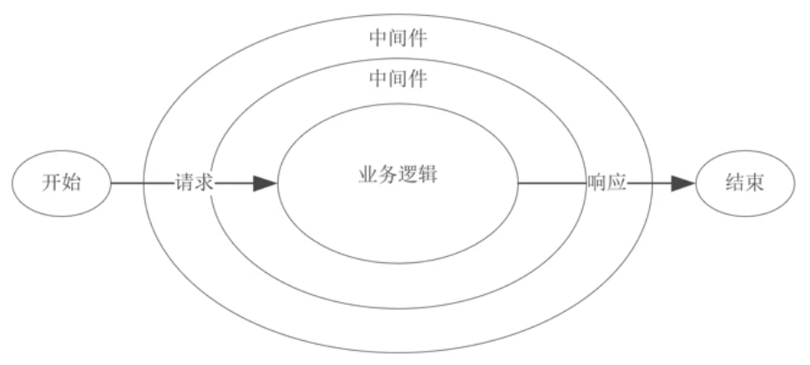

[[toc]]

## fs 模块常用API

所有的同步方法都有一个对应的异步方法，异步方法都需要增加一个**回调函数参数**来处理操作执行完成后的逻辑，这里不再阐述异步的 API。

- `fs.readFileSync(path[, options])`：同步读取文件，选项可以设置编码格式和标识符（若没有设置编码格式默认返回一个 **Buffer** 对象）。
- `fs.writeFileSync(file, data[, options])`：同步文件写入，写入的数据通常为 `String` 或 `Buffer`。
- `fs.appendFileSync(path, data[, options])`：同步文件追加（调用 `writeFileSync` 并设置标识符为 `a` 也是同样的效果）。
- `fs.copyFileSync(src, dest[, mode])`：同步地复制 `src` 到 `dest`。Node.js 不保证复制操作的原子性。如果在打开目标文件进行写入后发生错误，Node.js 将尝试删除目标文件。
- `fs.mkdirSync(path[, options])`：同步创建文件夹，选项中可以设置 `recursive` 为 `true` 来递归创建目录。
- `fs.rmSync(path[, options])`：同步删除文件和目录，选项中可以设置 `recursive` 为 `true` 来递归删除文件和目录。
- `fs.statSync(path[, options])`：同步获取资源信息，返回一个 `fs.Stats` 对象，该对象有两个方法 `isDirectory()` 和 `isFile()` 可以用于判断该资源是否为<u>目录或文件</u>。

流式读取、写入方法：

- `fs.createReadStream(path[, options])`：返回一个读取流对象。

  要获取流中的数据，需要在该读取流对象中调用 `on` 方法并监听 `data` 事件，每次读取 64KB 的数据。

- `fs.createWriteStream(path[, options])`：返回一个写入流对象。

  调用写入流对象上的 `write` 方法来流式写入数据。

- 还可以通过管道 `pipe` 来方便地将读取流中的数据传递给写入流对象。

```js
const rs = fs.createReadStream('./video.mp4')
const ws = fs.createReadStream('./video-copy.mp4')
rs.pipe(ws)
```

流式操作相对正常文件读取写入方式能更好地利用内存空间，每次读取 64KB，边读取边写入（通常读取速度比写入速度要快），减少了内存空间的占用。

## 全局对象

### 真正的全局对象

- **global**：<u>全局命名空间对象</u>，有点类似于浏览器环境中的 window 对象。

  但也有区别，在 Node 环境中，如果我们在 js 文件中直接用 `var` 声明一个变量，是不会被添加到 global 对象中的。因为在 Node 里一个 js 文件只是一个独立的模块而已，所以我们在其中声明的变量并不会是一个全局的变量。

- **process**：提供当前<u>进程</u>的相关信息。

- **console**：<u>控制台</u>对象。

- **Buffer**：存储<u>二进制类型</u>数据。

- 定时器延时器函数

### 模块中的全局对象

这种全局对象实际上是<u>模块中的变量</u>，只是每个模块中都存在这些对象，所以看起来像全局的。但在 Node 命令行中去访问这些模块中的全局对象是访问不到的。

- **__dirname**：获取当前文件所在路径，<u>不包括</u>最后的文件名。
- **__filename**：获取当前文件所在路径，<u>包括</u>最后的文件名。
- exports：指定一个模块所导出的内容（属性）。
- module：通过 **module.exports** 来指定一个模块所导出的内容（对象）。
- require：导入一个模块。

## 事件循环

1. **timer** 阶段：执行 <u>setTimeout</u> 和 <u>setInterval</u> 注册的回调函数。
2. **pending callback** 阶段：执行上一次事件循环中被延时的 I/O 回调函数。
3. **idle prepare** 阶段：仅用于 nodejs 内部模块的使用。
4. **poll** 轮询阶段：轮询是否有 I/O 任务完成，如果有则执行相应的回调函数。否则，会在此阶段一直等待新的任务到达。当有  <u>setImmediate</u> 注册的回调函数时，那么将会进入 check 阶段。
5. **check** 阶段：执行 <u>setImmediate</u> 注册的回调函数。
6. **close** 阶段：执行 <u>close</u> 事件的回调函数。

每个阶段可以认为是不同宏任务的执行阶段，因此可以认为在 Node 中，宏任务之间有优先级关系，延时器定时器优先级最高。每个阶段完成后，需要执行 **nextTick** 队列和微任务队列中的任务，nextTick 的优先级<u>大于</u>微任务的优先级。

## 中间件

中间件本质上就是一个函数，它会在服务的整个处理流程的不同时机（通常是在收到请求与请求业务逻辑之间）去执行，然后将请求传递给下一个中间件或者路由处理程序。在 `koa` 框架中，中间件还可以在业务逻辑处理完成之后继续执行。

我们可以将一些公共逻辑的处理抽象出来，封装在中间件中，这样就不用在每一个路由回调中去编写重复的代码。在实现中间件时，单个中间件应该足够简单，**职责单一**，中间件的代码编写应该高效，必要的时候通过缓存重复获取数据。

### Koa 洋葱模型

Koa 是一个中间件框架，它并不像 Express 那样还包含了许多其他的功能，例如路由和模板（第三方库支持）。因此，Koa 可被视为 Node.js 的 `http` 模块的抽象，而 Express 是 Node.js 的**应用程序**框架。

Koa 最具特色地是它通过 `Promise` 或 `async/await` 使得中间件可以在业务（路由）逻辑处理完成之后继续执行，利用这种执行逻辑使得 Koa 可以实现更加复杂的逻辑。



**整个服务的执行逻辑**：以 `next()` 为分割点，先在请求接收阶段<u>由外到内</u>执行中间件中 `next()` 之前的代码，再在请求响应阶段<u>由内到外</u>执行 `next()` 之后的代码。

就像洋葱一样，最先经过的洋葱圈最终又会在最后经过。又像浏览器的事件触发阶段，先捕获到目标元素然后冒泡到最上层元素。

### koa-compose

可以通过 [koa-compose](https://github.com/koajs/compose) 来将多个中间件 “组合” 成一个单一的中间件，以便于重用或导出，

```js
const compose = require('koa-compose');

async function random(ctx, next) {
  if ('/random' == ctx.path) {
    ctx.body = Math.floor(Math.random() * 10);
  } else {
    await next();
  }
};

async function backwards(ctx, next) {
  if ('/backwards' == ctx.path) {
    ctx.body = 'sdrawkcab';
  } else {
    await next();
  }
}

const all = compose([random, backwards]);
app.use(all);
```

手写实现：

```js
function compose(middlewares) {
  // 返回一个中间件函数，接收 ctx 参数
  return function (ctx) {
    // 定义一个递归函数，参数为当前执行的中间件下标
    const dispatch = (i) => {
      // 是否已经全部执行
      if (i === middlewares.length) return
      else {
          // 取出中间件函数
          const middleware = middlewares[i]
          // 调用中间件函数，并传入 ctx 对象和 next 函数
          // next 函数 => 下一个中间件函数（这里需要判断是否全部执行，所以调用我们的递归函数，并用一个函数封装）
          return middleware(ctx, () => dispatch(i + 1))
      }
    }
    // 执行第一个中间件函数，开始递归
    return dispatch(0);
  }
}
```

