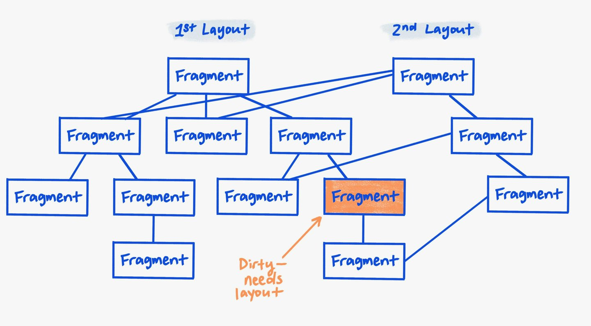
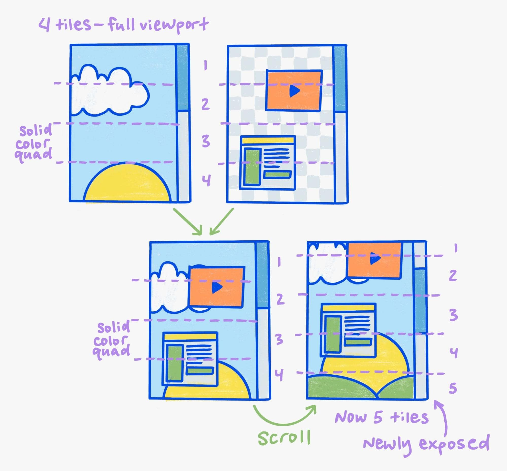

[[toc]]

> 本文是对[这篇文档](https://developer.chrome.google.cn/docs/chromium/renderingng-data-structures?hl=zh-cn)的一个总结

## 不可变 Fragment 树

不可变 Fragment 树是渲染管线中**布局阶段的输出**，表示网页元素的**位置和大小（未应用转换）**。

每个 Fragment 代表 **DOM 元素的一部分**，通常一对一映射，特殊场景（如多列布局、分页）可对应多个 Fragment。布局后，每个 Fragment 都会变为**不可变**，并且永远不会再发生更改。除此之外，每个 Fragment 还会有一些额外限制：

- 子节点不包含指向父节点的指针。
- 子节点只能读取自身节点信息，不能通过子节点访问父节点数据，确保布局逻辑的独立性。

不可变性以及这些限制保证了 Fragment 的独立性和数据的正确性（不存在脏数据），从而确保后续阶段（如绘制、合成）可以**安全复用**。如果没有这些限制，渲染进程就需要经常重新生成整个树，这会很耗费资源。

而这一点又基于一个理念，就是 <u>“大多数布局通常是**增量更新**”</u>。例如，Web 应用在用户点击某个元素时更新界面中的一小部分。理想情况下，布局应仅执行与屏幕上实际发生的更改成正比的工作。我们可以通过尽可能重复使用上一个树的大多数的 Fragment，仅重新计算发生变化的 Fragment。

## 属性树（Property Trees）

在 Web 上，视觉效果和滚动效果非常复杂。为了将这种复杂性转换为一个精确表示其结构和含义的单一数据结构，同时移除 DOM 和 CSS 的其余复杂性，因此就有了**属性树**。

每个页面文档都有**四个**单独的属性树：

- 转换树（*transform tree*）：表示 `transform` 和滚动。
- 剪裁树（*clip tree*）：表示 `overflow` 的溢出剪裁。
- 效果树（*effect tree*）：表示所有其他视觉效果（`opacity`、`filters`、`masks`、`blend-mode`），以及其他类型的剪裁（例如 `clip-path`）。
- 滚动树（*scroll tree*）：表示关于滚动的信息，例如[滚动链](https://developer.mozilla.org/zh-CN/docs/Web/CSS/overscroll-behavior)。

每个 DOM 元素都有一个**属性树状态**，它是一个 4 元组（transform、clip、effect、scroll）对应这四种树，表示对该元素有效的**最近**的祖先属性树节点。

## 合成器帧（Compositor Frame）

合成器帧是渲染管线的**最终输出**，封装了用于 GPU 绘图的核心资源，包括 **Surface、渲染通道（Render Pass）和 GPU 纹理图块（Texture Tile）**，负责将光栅化内容高效拼接并呈现到屏幕。

### 图块（Tile）

渲染时会将视口划分为独立的 **GPU 纹理图块**，每个图块对应视口的某一部分。这样，渲染进程可以只更新单个图块，甚至只需更改现有图块在屏幕上的位置，从而避免重新光栅化整个视口。

### 四边形（Quad）

GPU 纹理图块是一种特殊的四边形。四边形是某一类纹理的专业术语，用于标识输入纹理，描述图块的**位置、变换和视觉效果**。

这些光栅化图块封装在渲染通道中，渲染通道是一个包含了四边形的列表。每个 GPU 纹理图块对应一个四边形。显示合成器线程（Viz进程中的）只需迭代这个四边形列表，使用指定的视觉效果绘制每个四边形，即可为对应的渲染通道生成所需的像素输出。

除了 GPU 纹理图块的四边形，还有其他类型的四边形。例如，有些纯色四边形完全不依赖纹理（称为**纯色四边形**），有些纹理四边形则适用于视频或 Canvas 画布等非分块纹理。

还有一个四边形叫做 “Surface 四边形”，接下来我们会介绍什么是 Surface。

### Surface

一个合成器帧中**还可以嵌入其他合成器帧**。例如，浏览器合成器线程会生成包含浏览器界面的合成器帧，以及用于嵌入渲染合成器线程内容的区域。还有一个例子就是具有网站隔离的 iframe。

这些嵌入是通过 Surface 来实现的。当渲染器提交合成器帧时，该帧会附带一个 ***Surface ID***，以便其他合成器帧通过该 ID 来引用该帧。

在 Viz 进程中会存储对应 Surface ID 的合成器帧，另一个合成器帧可以通过 “Surface 四边形” 来引用该 ID，这样 Viz 进程就知道要绘制什么内容。这个 Surface 四边形<u>仅包含 Surface ID，不包含任何纹理数据</u>。

### 中间渲染通道

某些视觉效果（如滤镜或高级混合模式）需要将两个或更多四边形绘制到中间纹理。然后，中间纹理会在应用视觉效果的同时绘制到 GPU 上的目标缓冲区。为此，合成器帧实际上包含一系列的渲染通道。其中始终有一个根渲染通道，它是最后绘制的，目标对应帧缓冲区，可能还包含一些子通道。

之所以称为 “渲染通道”，是因为可以执行多次渲染步骤。每个通道必须在 GPU 上以多个 “步骤” 的形式顺序执行，而单个步骤可以通过单次大规模并行 GPU 计算完成。

### 聚合（Aggregate）

多个合成器帧会提交给 Viz，并需要一起绘制到屏幕上。这些合成器帧会在聚合阶段被转换为单个全局的合成器帧，并**消除冗余绘制**。

聚合会将 Surface 四边形替换为它们引用的合成器帧，这也是优化掉不必要的中间纹理或屏幕外内容的时机。因为如果两个不同渲染进程的合成器帧存在重叠区域，单个渲染合成器无法判断是否可以合并绘制四边形，必须由 Viz 在聚合阶段分析处理。聚合阶段会根据各个的渲染合成器无法获取的全局信息，找出并应用此类优化。例如，在许多情况下，网站隔离的 iframe 的 合成器帧不需要自己的中间纹理，可以通过适当的四边形直接绘制到帧缓冲区。
