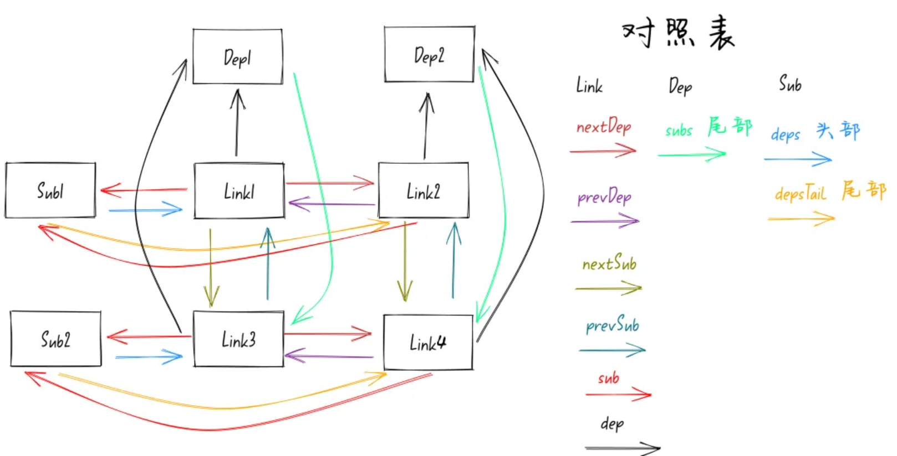
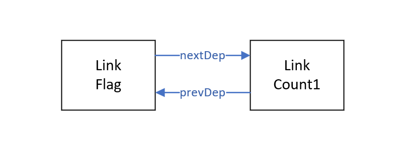
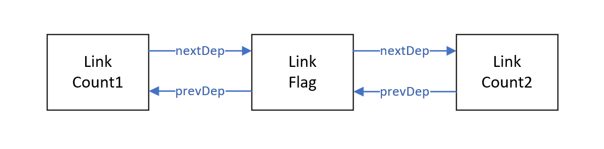
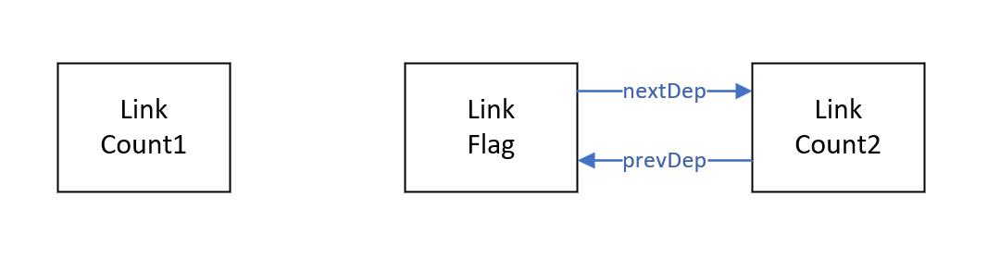

[[toc]]

在 2024 年 9 月 3 日，Vue 发布了 3.5.0 版本的更新。在 3.5 版本中，Vue 对响应式系统做了一个大的重构，将过去通过 `WeakMap` 存储副作用函数（`watchEffect`、`watch`、`computed`、`render`，又叫做订阅者）与响应式数据（发布者）之间依赖关系的方式转变为采用 **Signals** 的响应式设计思想（**双向链表**和**版本计数**）。

这篇文章重点说明双向链表如何解决依赖清理问题，对于版本计数的详细内容会在后续的文章中进行补充。

当然，这次响应式系统的重构也不是第一次，在 3.4 版本中已经对 Vue 的响应式进行了一次大的修改，但也就存在了一个子版本后就被 3.5 的双向链表和版本计数给替代了，所以这次重构也不知道后续会不会发生进一步的变化。

> 从目前 Vue 3.6 版本（[minor](https://github.com/vuejs/core/tree/minor) 分支）已合并的 [PR](https://github.com/vuejs/core/pull/12570) 来看，未来将引入 [Alien Signals](https://github.com/stackblitz/alien-signals) 来进一步优化响应式系统性能。

## 目的

重构的一个主要目的是当响应式数据与副作用函数之间的依赖关系发生变化时，最大地复用依赖关系，以优化内存空间和性能。

以上这段话是什么意思呢？我们来看看在 3.5 版本之前时，Vue 响应式系统在面对响应式数据与副作用函数之间的依赖关系发生变化时，是如何处理的。先来看段代码：

```vue
<template>
    <p>{{ doubleCount }}</p>
    <button @click="flag = !flag">切换flag</button>
</template>

<script setup>
    import { computed, ref } from "vue"
    const count1 = ref(1)
    const count2 = ref(10)
    const flag = ref(true)

    const doubleCount = computed(() => {
        console.log("computed")
        if (flag.value) {
            return count1.value * 2
        } else {
            return count2.value * 2
        }
    })
</script>
```

以上代码表示的是，当 `flag` 的值为 `true` 时计算属性 `doubleCount` 只依赖于响应式变量 `flag` 和 `count1`，当 `flag` 的值变为 `false` 时，计算属性应该变成依赖于响应式变量 `flag` 和 `count2`。

可以发现，在这两种变换中，计算属性都依赖于响应式变量 `flag`。但在旧版本中，Vue 的响应式系统在面对这种情况的处理是先把原依赖响应式数据中关于该副作用函数的关系在 `Map` 中删除，然后再重新执行副作用函数时再去对新的响应式变量进行收集。很显然，这里存在部分依赖关系可以复用，存在一些不必要的内存和性能开销。

为了解决这个问题，Vue 3.5 版本中改用了**双向链表**的数据结构来管理两者的依赖关系。

## 双向链表

新的响应式模型如下：



可以发现这里的模型中多了一个新的类——***Link***，它将副作用函数与响应式数据关联了起来。

一个 Link 节点会存在于两条双向链表中，一条用于关联<u>响应式数据对副作用函数</u>的关系，另一条用于关联<u>副作用函数对响应式数据</u>的关系。换句话说，响应式数据与副作用函数之间的关系由原来的**一对多**变成了**多对多**的关系。在过去的版本中，Vue 中是没有存储副作用函数对响应式数据的关系的，也就是说我们不能通过副作用函数找到依赖的响应式数据。

本文将关联响应式数据对副作用函数的关系的双向链表称为 ***Dep to Subs doubly-linked list***，关联副作用函数对响应式数据的关系的称为 ***Sub to Deps doubly-linked list***。

这里的三个类：*Sub*（副作用函数）、*Dep*（响应式数据）、*Link*（节点），它们各自包含的成员变量如下（简化）：

```ts
interface Subscriber {
    // 指向当前副作用函数的 Sub to Deps doubly-linked list 链表的头部节点
    deps: Link
    // 指向当前副作用函数的 Sub to Deps doubly-linked list 链表的尾部节点
    depsTail: Link
    // 指向当前副作用函数在 batchedEffect 链表中的下一个副作用函数
    next: Subscriber
    // 执行函数
    notify: Function
}
```

```ts
class Dep {
    // 指向当前响应式数据的 Dep to Subs doubly-linked list 链表的尾部节点
    subs: Link
    // 收集依赖
    track: Function
    // 触发依赖
    trigger: Function
    // 通知依赖
    notify: Function
}
```

```tsx
class Link {
    // 指向 Subscriber 副作用函数
    sub: Subscriber
    // 指向 Dep 响应式数据
    dep: Dep
    // 指向当前所在的 Sub to Deps doubly-linked list 链表的下一个节点
    nextDep: Link
    // 指向当前所在的 Sub to Deps doubly-linked list 链表的上一个节点
    prevDep: Link
    // 指向当前所在的 Dep to Subs doubly-linked list 链表的下一个节点
    nextSub: Link
    // 指向当前所在的 Dep to Subs doubly-linked list 链表的上一个节点
    prevSub: Link
}
```

采用双向链表的结构在新增、删除和迭代上的时间复杂度与之前的 `WeakMap` 和 `Set` 的方式并没有什么不同，新增删除都是 O(1)，迭代都是 O(n)。双向链表带来的好处主要在于：

> [!Tip] 优点
>
> 1. 优化创建开销：`Set` 的创建开销相对昂贵，尤其是对于一个 `computed` 至少需要两个 `Set` 集合来维护依赖关系。
> 2. **依赖清理**时的数据复用：`Set` 需要先移除再添加或者清空重建内部依赖关系，存在内存抖动；而链表可以很好地复用节点。

### 依赖清理

之前说到，在旧版本中部分的依赖关系并没有很好地得到复用，我们看看在双向链表中是如何进行依赖清理的。

首先在全局中存在一个 `WeakMap`，用以管理所有响应式数据中不同属性对应的 `Dep` 实例，这些 `Dep` 实例通过全局的 `track` 函数收集。

```tsx
type KeyToDepMap = Map<any, Dep>;
const targetMap = new WeakMap<object, KeyToDepMap>();

export function track(target: object, type: TrackOpTypes, key: unknown): void {
  // 检查是否应该收集依赖
  if (shouldTrack && activeSub) {
    // 获取目标对象的依赖 Map
    let depsMap = targetMap.get(target);
    if (!depsMap) {
      // 如果不存在，创建一个新的 Map
      targetMap.set(target, (depsMap = new Map()));
    }

    // 获取属性的依赖对象
    let dep = depsMap.get(key);
    if (!dep) {
      // 如果不存在，创建一个新的 Dep 实例
      depsMap.set(key, (dep = new Dep()));
      // 保存反向引用，用于清理
      dep.map = depsMap;
      dep.key = key;
    }

    // 开发环境下收集更多的调试信息
    if (__DEV__) {
      dep.track({
        target,
        type,
        key,
      });
    } else {
      dep.track();
    }
  }
}
```

全局的 `track` 函数会在访问响应式数据时，即在对应 `Proxy` 对象定义的捕获函数 `get` 中调用。

然后来看下 `dep.track` 方法中关于节点维护的代码：

```ts
let link = this.activeLink;
if (link === undefined || link.sub !== activeSub) {
     // 创建新的 Link 并建立链表关系
     link = this.activeLink = new Link(activeSub, this);

     // 将 link 添加到 activeSub 的依赖链表尾部
     if (!activeSub.deps) {
         activeSub.deps = activeSub.depsTail = link;
     } else {
         link.prevDep = activeSub.depsTail;
         activeSub.depsTail!.nextDep = link;
         activeSub.depsTail = link;
     }

     addSub(link);
 }
```

以上的代码的意思是，若当前是一个新的依赖关系时如何创建新的节点并添加进链表中。根据以上的逻辑，对于文章一开始的例子可以得到以下的链表（省去副作用函数和响应式数据节点）：



那如果当前是一个存在的依赖关系时，则其逻辑如下：

```ts
else if (link.version === -1) {
    // 复用上次运行的 link - 已经是订阅者，只需同步版本
    link.version = this.version;

    // 如果这个 dep 有下一个节点，说明它不在尾部
    // 需要将它移动到尾部，确保 effect 的依赖列表按访问顺序排序
    if (link.nextDep) {
        // 1. 从当前位置断开
        const next = link.nextDep;
        next.prevDep = link.prevDep;
        if (link.prevDep) {
            link.prevDep.nextDep = next;
        }

        // 2. 移动到尾部
        link.prevDep = activeSub.depsTail;
        link.nextDep = undefined;
        activeSub.depsTail!.nextDep = link;
        activeSub.depsTail = link;

        // 如果是头节点，更新新的头节点
        if (activeSub.deps === link) {
            activeSub.deps = next;
        }
    }
}
```

因此根据以上逻辑，当 `flag` 的值变为 `false` 时，此时的链表结构将会变为：



从上图可以看出，副作用函数重新执行的时候，访问到哪个响应式数据，就会断开这个响应式数据对应的 Link 链接，重新添加到链表的尾部，形成一个新的顺序。而且这些 Link 可以复用，并没有重新创建，只是修改了它们的指针指向。

副作用函数执行前，会调用 `prepareDeps` 函数，将该副作用函数的 *Sub to Deps doubly-linked list* 链表上的所有 Link 节点的 `version` 属性重置为 `-1`。在执行依赖收集函数 `track` 时，`link.version` 会同步到跟 `dep.version` 相同的版本。如果最后版本值还是 `-1`，说明该副作用函数不再依赖该响应式数据。

```ts
function prepareDeps(sub: Subscriber) {
    for (let link = sub.deps; link; link = link.nextDep) {
        link.version = -1	// [!code highlight]
        link.prevActiveLink = link.dep.activeLink
        link.dep.activeLink = link
    }
}
```

当副作用函数执行完毕后，就会执行 `cleanupDeps` 函数。此时会遍历该副作用函数的 *Sub to Deps doubly-linked list* 链表，判断 Link 节点的 `version` 属性是否为 `-1`，从而将不再依赖的响应式数据从链表中移除。

```tsx
function cleanupDeps(sub: Subscriber) {
    // 清除无用 Deps
    let head
    let tail = sub.depsTail
    let link = tail
    while (link) {
        const prev = link.prevDep
        if (link.version === -1) {	// [!code highlight]
            if (link === tail) tail = prev
            // 从 Dep to Subs doubly-linked list 链表中移除
            removeSub(link)	// [!code highlight]
            // 同时也从 Sub to Deps doubly-linked list 链表中移除
            removeDep(link)	// [!code highlight]
        } else {
            // The new head is the last node seen which wasn't removed
            // from the doubly-linked list
            head = link
        }

        // restore previous active link if any
        link.dep.activeLink = link.prevActiveLink
        link.prevActiveLink = undefined
        link = prev
    }
    // set the new head & tail
    sub.deps = head
    sub.depsTail = tail
}
```

因此，经过清除后，链表结构变为：



此时 Link Count1 不被任何其他变量引用，最后会被垃圾回收机制所回收。

## 小结

因此，我们可以发现，通过横向链表——***Sub to Deps doubly-linked list*** 和版本计数可以让我们找到副作用函数中不再依赖的响应式数据并清除，同时最大地复用之前存在的依赖关系，从而优化了依赖清理中的内存开销。

而纵向链表——***Dep to Subs doubly-linked list*** 便是在响应式数据发生变化时，通过迭代纵向链表去执行依赖于该响应式数据的副作用函数。

但是注意，`Dep` 只有一个指向链表尾部 Link 的指针 `subs`，也就是说是从最后的 Link 节点向上遍历找到所有的副作用函数。在 `dep.notify` 方法中通过节点的 `prevSub` 指针来迭代 *Dep to Subs doubly-linked list* 链表以通知所有依赖于该响应式数据的副作用函数。

```tsx
// dep.notify
// 该方法会在 dep.trigger 中调用
notify(debugInfo?: DebuggerEventExtraInfo): void {
    startBatch()
    try {
      // ...
      for (let link = this.subs; link; link = link.prevSub) {	// [!code highlight]
        if (link.sub.notify()) {	// [!code highlight]
          // 如果 notify() 返回 true，说明该副作用函数是一个 computed
          // （其他副作用函数会返回 undefined）
          // 因此，还需要通知依赖了该 computed 的副作用函数
          // 在这里调用而不是在 computed 内部通知，是为了避免过长的递归调用栈
          ;(link.sub as ComputedRefImpl).dep.notify()
        }
      }
    } finally {
      endBatch()
    }
  }
}
```

在这里我们可以发现两个新的函数——`startBatch` 和 `endBatch`，这是 Vue 3.5 引入的批处理 API，使得副作用函数不会立即执行，而是先将所有需要重新执行的副作用函数通过一个 <u>`batchedSub` 链表</u>关联起来。

在执行 `sub.notify` 方法时，会执行一个 `batch` 函数。在该函数中会维护一个 `batchedSub` 链表，执行时将当前的副作用函数添加到链表的头部位置。

```tsx
let batchDepth = 0
let batchedSub: Subscriber | undefined
let batchedComputed: Subscriber | undefined

export function batch(sub: Subscriber, isComputed = false): void {
  sub.flags |= EffectFlags.NOTIFIED
  if (isComputed) {
    sub.next = batchedComputed
    batchedComputed = sub
    return
  }
  sub.next = batchedSub	// [!code highlight]
  batchedSub = sub	// [!code highlight]
}
```

因此不是向下遍历的原因，是因为此处链表维护的逻辑。最终在 `endBatch` 函数中遍历 `batchedSub` 链表时，仍然是从前往后去执行副作用函数的 `trigger` 方法来重新执行函数的。

其次，我们需要注意的是，`computed` 是一个特殊的副作用函数，**它既可以作为副作用函数（`Sub`），又可以作为响应式数据（`Dep`）**。因此在通知此时作为副作用函数的 `computed` 时，那么还会通知依赖了该 `computed` 的副作用函数。同时，在 `computed` 的 `notify` 方法中调用 `batch` 函数时还会传递第二个参数 `isComputed` 为 `true`，使得当前的 `computed` 副作用函数不会被添加到 `batchedSub` 链表，而是添加到 `batchedComputed` 链表中。

后续的逻辑会涉及到版本计数，这里留到下一篇文章中继续讲述。

## 参考资料

https://juejin.cn/post/7418548134593249289

https://juejin.cn/post/7436524595273908262
