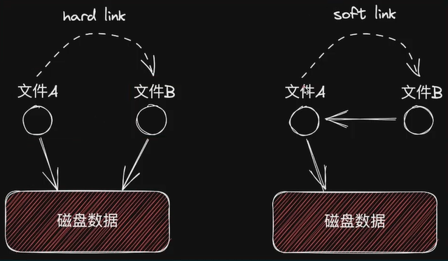
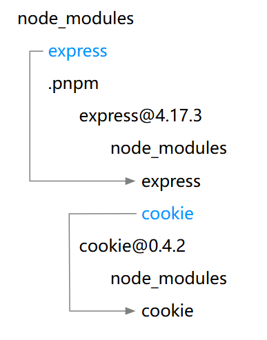

[[toc]]

## pnpm 独特的存储策略

与 npm 每次都要将依赖下载（复制）到项目中不同，pnpm 将下载的依赖包存储在一个**全局**的存储位置。当依赖包被安装时，包里的文件会**硬链接**到这一位置，而<u>不会占用额外的磁盘空间</u>，使得可以跨项目地共享同一版本的依赖。又由于这个特性，使得 pnpm 的依赖<u>安装速度也会更快，因为没有写入（复制）的过程</u>。

### 硬链接



硬链接是通过在目录项中创建一个新的文件名条目，该条目指向与源文件相同的 inode（索引节点）。inode 就像是一个指针，它指向文件实际存储数据的位置。当创建硬链接时，从磁盘空间占用的角度来看，<u>并没有为硬链接文件分配新的磁盘空间来存储文件数据</u>。从文件系统的角度来看，这些硬链接<u>实际上是同一个文件，只是有不同的文件名或者位于不同的目录中</u>。

例如，有一个源文件大小为 10MB，创建硬链接后，虽然看起来有两个文件（源文件和硬链接文件）且它们显示的文件大小都是 10MB，但实际上在磁盘上只有一份 10MB 的数据存储，两个文件共享这同一份数据。

## 非扁平的 node_modules 目录

使用 npm 安装依赖项时，所有的包都被提升到模块目录的根目录。 例如，当我们要安装 `express` 时，采用 npm 安装时 `node_modules` 的目录结构：

```
.bin
accepts
array-flatten
body-parser
bytes
content-disposition
cookie-signature
cookie
debug
depd
destroy
ee-first
encodeurl
escape-html
etag
express
```

可以发现，所有的依赖都是平级的，没有层次关系，即扁平的目录结构。<u>扁平结构可以避免深层次依赖导致较长的路径</u>，同时相对于层次依赖还能够减少重复的子依赖项。

但这会导致一个问题，我们没有直接安装子依赖（`package.json`没有记录该依赖），但却可以直接访问依赖项的子依赖，这种依赖又被称为**幽灵依赖**。

### 幽灵依赖

幽灵依赖会带来两个问题，一个是版本问题，另一个是依赖丢失问题。

现有一个依赖项 A，A 依赖了另一个依赖项 B，讨论如下两个情况：

- **版本问题**

  当依赖项 A **更新了**依赖项 B 的版本时，而我们的项目代码中仍是使用依赖项 B 旧版本的特性。如果 B 的新版本没有向后兼容，就会出现莫名其妙的报错。（`package.json` 中没有记录依赖项 B，所以无法对 B 进行版本控制）

- **依赖丢失问题**

  依赖项 A 是一个**开发环境**下的依赖，那么就会导致<u>在生产环境下不会打包依赖项 A，对于其子依赖 B 也不会进行打包</u>。因此，若我们在项目中使用到了依赖项 B，在生产环境下就会出现依赖丢失问题。

### pnpm 非扁平的目录结构

若使用 pnpm 安装时的目录结构：

```
.pnpm
.modules.yaml
express
```

可以发现只有我们所安装的依赖，它通过**符号链接**的方式创建。

`express` 的实际位置则在 `node_modules/.pnpm/express@4.17.3/node_modules/express`，而该文件则是通过**硬链接**的方式将全局存储位置对应的依赖项链接到该位置。

那 `express` 所依赖的依赖项呢？

它的依赖项则与该硬链接的 `express` 同级，即包的依赖项与依赖包的实际位置位于同一目录级别。所以 `express` 的依赖是在 `.pnpm/express@4.17.3/node_modules/`。



但 `express` 的所有依赖项都是以**符号链接**的方式<u>将实际的位置链接到与其同级的目录下</u>，同时这些依赖项的实际位置也是通过**硬链接**的方式<u>将全局存储中的位置链接到</u> `node_modules/.pnpm` <u>中对应的目录中</u>。

如果存在 peer 依赖（peer dependencies），那么它可能就会有多组依赖项，所以不同的 peer 依赖项会创建不同的解析：

```
node_modules
└── .pnpm
    ├── foo@1.0.0_bar@1.0.0+baz@1.0.0
    │   └── node_modules
    │       ├── foo
    │       ├── bar   -> ../../bar@1.0.0/node_modules/bar
    │       ├── baz   -> ../../baz@1.0.0/node_modules/baz
    │       ├── qux   -> ../../qux@1.0.0/node_modules/qux
    │       └── plugh -> ../../plugh@1.0.0/node_modules/plugh
    ├── foo@1.0.0_bar@1.0.0+baz@1.1.0
    │   └── node_modules
    │       ├── foo
    │       ├── bar   -> ../../bar@1.0.0/node_modules/bar
    │       ├── baz   -> ../../baz@1.1.0/node_modules/baz
    │       ├── qux   -> ../../qux@1.0.0/node_modules/qux
    │       └── plugh -> ../../plugh@1.0.0/node_modules/plugh
    ├── bar@1.0.0
    ├── baz@1.0.0
    ├── baz@1.1.0
    ├── qux@1.0.0
    ├── plugh@1.0.0
```

但本质上都是一致的：使用符号链接与扁平目录来构建一个嵌套结构，通过硬链接来链接实际的依赖包。

## workspace

工作区允许将多个项目（通常是相关的项目，比如一个包含多个子模块的大型项目或一个 **monorepo** 项目，即**单仓库多项目**管理方式）放在同一个根目录下进行管理。这些项目可以**共享依赖**，并且可以方便地在它们**之间建立链接和引用**，从而提高开发效率、减少重复工作和磁盘空间占用。

在仓库根目录下创建一个 `pnpm-workspace.yaml` 文件，在 `pnpm-workspace.yaml` 文件中，通过 `packages` 字段来定义哪些子目录是工作区的一部分。比如：

```
packages:
  # packages目录下的直接子目录都属于该工作区（*）
  - 'packages/*'
  # components目录下的所有文件都属于该工作区（**）
  - 'components/**'
  # test目录不属于该工作区（！）
  - '!test'
```

- 配置工作区的一个目的就在于便于**共享依赖**。

  工作区内的项目可以共享依赖。当在工作区根目录下安装依赖时，所有工作区内的项目都可以使用该依赖。

  例如，在工作区根目录执行 `pnpm add vue`，那么所有工作区内的项目都可以直接使用 `vue`，无需在每个项目中单独安装。

- 另一个目的就是便于**项目之间建立引用**。

  工作区内的项目可以方便地相互引用。可以通过相对路径或者 **workspace** 协议来引用其他项目。在开发过程中，通过这个特性可以方便地在不同项目之间共享模块、组件等代码。

  例如，项目 `A` 需要引用项目 `B`，可以在项目 `A` 的 `package.json` 中添加依赖：`"B": "workspace:*"`，这样就建立了项目间的引用。

- 最后就是便于**并行构建和统一脚本管理**

  使用 `pnpm run build --parallel` 可以并行地在工作区内的各个项目中执行构建脚本。

  可以在工作区根目录下定义统一的脚本，对工作区内的所有项目执行相同的操作。比如，在根目录下定义一个测试脚本，然后在所有项目中执行统一的测试流程。