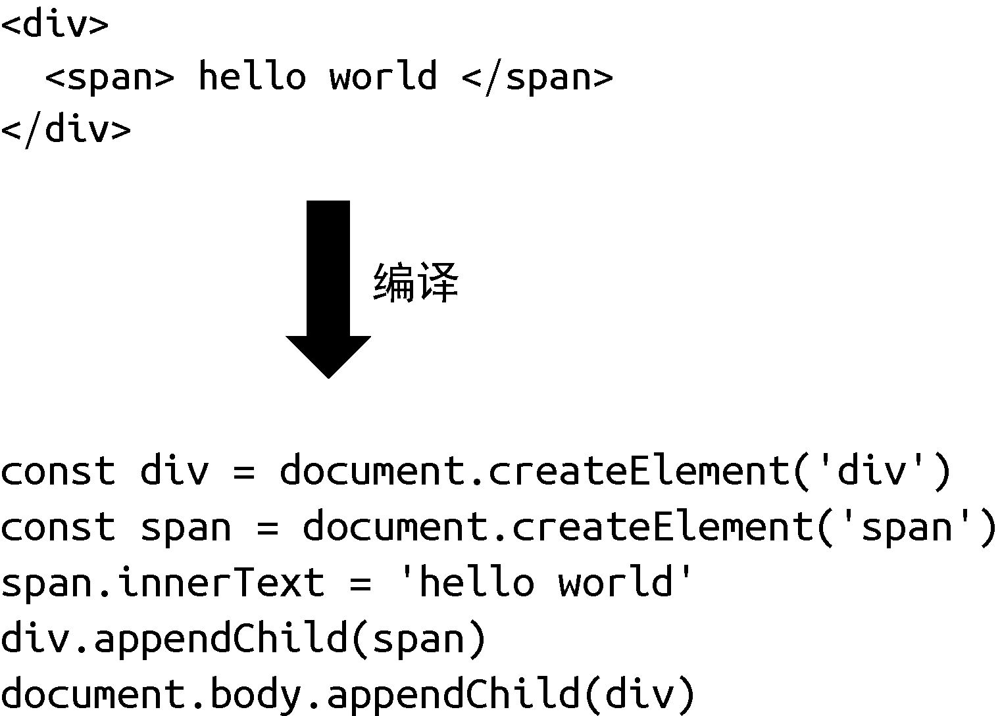
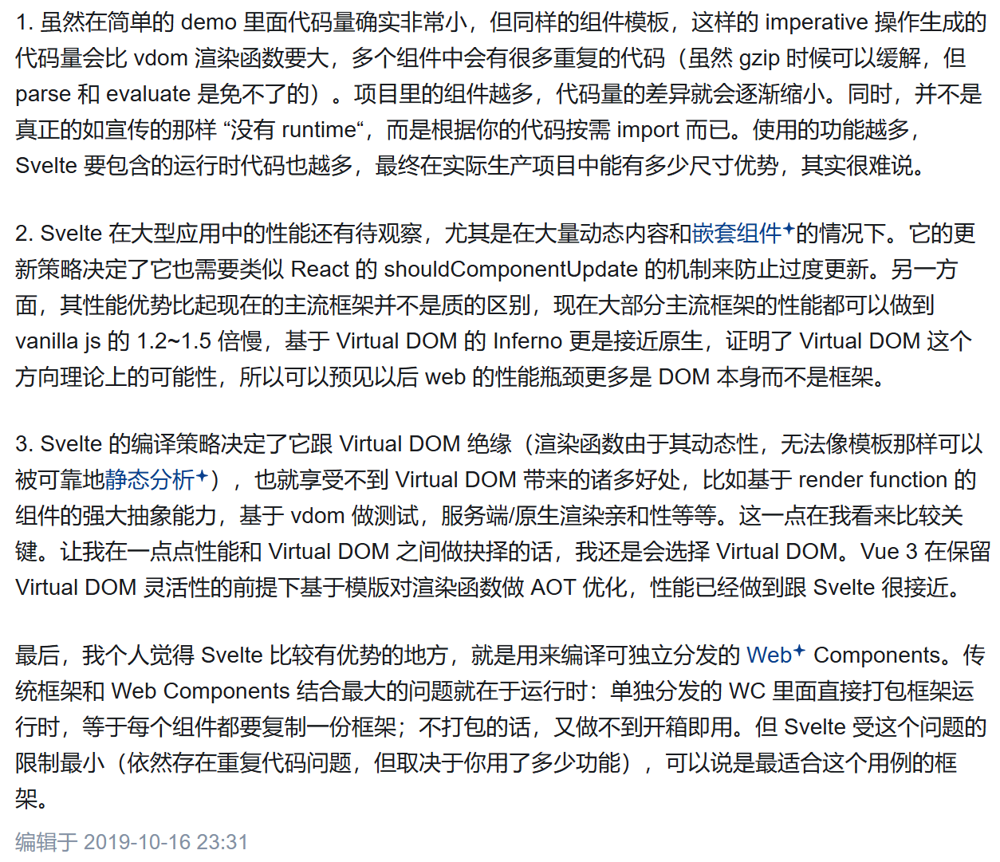

[[toc]]

大家在刚接触 MVVM 框架的时候，例如 Vue 或者 React，都会接触到虚拟 DOM 这个概念，因为虚拟 DOM 是实现这些 MVVM 框架的基础。在一些博客或者是所谓的八股文中，它们认为直接操作 DOM 的性能是昂贵的，而虚拟 DOM 可以提高性能。起初，我也是这么浅显地认为，最近回去再看了一遍《Vue.js的设计与实现》，更加深刻地理解了虚拟 DOM 的含义。

> 在 Vue 的官方文档中，是这么描述虚拟 DOM 的作用的：“虚拟 DOM 带来的主要收益是它让开发者能够**灵活、声明式地创建、检查和组合所需 UI 的结构**，同时只需把具体的 DOM 操作留给渲染器去处理。”

## 命令式和声明式

在讲虚拟 DOM 前，先讲讲什么是命令式和声明式。

衡量一个框架是否足够优秀的其中一个指标就是看它的**开发体验**如何，而 MVVM 设计模式的优点就在于，开发者不需要关注数据与视图之间的更新逻辑，这部分的逻辑都交给框架来处理，开发者只需要关注数据和视图即可。这在过去的 MVC 设计模式是做不到的，这也是为什么现在的项目框架都是采用 Vue 或 React 框架的原因，MVVM 框架极大地提高了开发效率。

在 Vue 或者 React 中，通过模板或渲染函数的方式，转换为虚拟 DOM 去描述 UI，属于**声明式**框架。而 MVC 框架大多数都是采用**命令式**代码，例如过去流行的 jQuery。

例如我们要说明一个文本内容为 hello world 的 div 元素，它绑定了一个点击事件，当点击时弹出一个提示。那么在 jQuery 下会这么写：

```js
$('#app') // 获取 div
	.text('hello world') // 设置文本内容
	.on('click', () => { alert('ok') }) // 绑定点击事件
```

 转换为原生 JS 就是：

```js
const div = document.querySelector('#app') // 获取 div
div.innerText = 'hello world' // 设置文本内容
div.addEventListener('click', () => { alert('ok') }) // 绑定点击事件
```

可以发现，命令式代码更关注“过程”，自然语言描述能够与代码产生一一对应的关系。

我们再来看看在 Vue 下如何编写：

```vue
<div @click="() => alert('ok')">hello world</div>
```

可以发现声明式代码直接给出的就是”结果“，至于如何实现这个“结果”，我们并不关心，而是交给框架去做。框架帮我们封装了这部分的**过程**，也就是说，框架内部的一定是命令式的，而暴露给开发者的是声明式的。

在命令式代码中，我们需要维护实现目标的整个过程，包括要手动完成 DOM 元素的创建、更新、删除等工作。而声明式代码展示的就是我们要的结果，看上去更加直观，至于做事的过程，并不需要我们关心，框架都为我们封装好了。

## 运行时和编译时

我们都知道在 Vue 中，可以通过**模板**或者**渲染函数**的方式来描述 UI，模板最终会被编译成虚拟 DOM，渲染函数本身返回的就是一个虚拟 DOM 对象。那为什么要有虚拟 DOM，为什么不能直接将模板转换为真实的 DOM，而是要转换为虚拟 DOM 之后再去创建真实的 DOM？其实这里对应的就是两种不同的框架设计思路——即<u>**运行时编译时**框架和**纯编译时**框架</u>。运行时编译时框架的代表就是现如今流行的 Vue 和 React 框架，纯编译时框架的代表则是新兴的 Svelte 框架。

### 纯运行时框架

我们先来说说什么是纯运行时框架。假设我们设计了一个框架，它提供一个 Render 函数，开发者可以为该函数提供一个树型结构的数据对象，这里的数据对象就是虚拟 DOM。然后 Render 函数会根据该对象递归地将虚拟 DOM 渲染成 DOM 元素。我们规定树型结构的数据对象如下：

```js
const obj = {
    tag: 'div',
    children: [
        { tag: 'span', children: 'hello world' }
    ]
}
```

接着，我们来实现 Render 函数：

```js
function Render(obj, root) {
    const el = document.createElement(obj.tag)
    if (typeof obj.children === 'string') {
        const text = document.createTextNode(obj.children)
        el.appendChild(text)
    } else if (obj.children) {
        // 数组，递归调用 Render，使用 el 作为 root 参数
        obj.children.forEach((child) => Render(child, el))
    }

    // 将元素添加到 root
    root.appendChild(el)
}
```

然后，开发者就可以这样这样来使用：

```js
const obj = {
    tag: 'div',
    children: [
        { tag: 'span', children: 'hello world' }
    ]
}
// 渲染到 body 下
Render(obj, document.body)
```

这个其实就是一个**纯运行**时框架。但存在一个问题，就是要手写一个树型结构的对象来表示 DOM 元素太麻烦了，能不能改用类似于 HTML 的方式来描述呢？

### 编译时运行时框架

Vue 的模板就是这么做的，通过编写一个编译器，把 HTML 字符串编译成树型结构的数据对象。

```js
const html = `<div><span>hello world</span></div>`
// 调用 Compiler 编译得到树型结构的数据对象
const obj = Compiler(html)
// 再调用 Render 进行渲染
Render(obj, document.body)
```

这个就是一个**运行时编译时**框架。它既支持运行时，开发者可以直接提供虚拟 DOM 从而无须编译（渲染函数）；又支持编译时，开发者可以提供 HTML 字符串（模板），我们将其编译为虚拟 DOM 后再交给运行时处理。

当然，上面的代码其实是**运行时编译**，意思是代码运行的时候才开始编译，而这会产生一定的性能开销。在 Vue 中，编译器会在构建的时候就执行编译器将开发者提供的内容编译好，等到运行时就无须编译了，这对性能是非常友好的。

### 纯编译框架

既然编译器可以把 HTML 字符串编译成虚拟 DOM，那么能不能直接编译成命令式代码去创建真实 DOM 呢？



当然可以，上图展示了将 HTML 字符串编译为命令式代码的过程。这样我们只需要一个 Compiler 函数就可以了，连 Render 都不需要了。其实这就变成了一个**纯编译时**的框架，因为我们不支持任何运行时内容，用户的代码通过编译器编译后就能运行。

但这又存在一个问题，我们不能通过提供一个数据对象的方式来表示 DOM 元素了，只能编写模板。而在一些情况下，尤其是<u>**高度动态渲染逻辑**的可重用组件</u>中，渲染函数与模板相比具有极高的灵活性，这也是虚拟 DOM 的优势之一。

看下如下这个例子，假如我们要表示一个标题，根据标题级别的不同，会分别采用 h1~h6 这几个标签，如果用虚拟 DOM 来描述，我们只需要使用一个变量来代表 h 标签即可：

```js
// h 标签的级别
let level = 3
const title = {
    tag: `h${level}`, // h3 标签
}
```

可以看到，当变量 level 值改变，对应的标签名字也会在 h1 和 h6 之间变化。但是如果使用模板来描述，就不得不穷举：

```vue
<h1 v-if="level === 1"></h1>
<h2 v-else-if="level === 2"></h2>
<h3 v-else-if="level === 3"></h3>
<h4 v-else-if="level === 4"></h4>
<h5 v-else-if="level === 5"></h5>
<h6 v-else-if="level === 6"></h6>
```

### 比较

首先是纯运行时的框架。由于它没有编译的过程，因此我们没办法分析开发者提供的内容。但是如果加入编译步骤，我们可以分析用户提供的内容，看看哪些内容未来可能会改变，哪些内容永远不会改变，这样我们就可以在编译的时候提取这些信息，然后将其传递给 Render 函数，Render 函数得到这些信息之后，就可以做进一步的优化了。然而，假如我们设计的框架是纯编译时的，那么它也可以分析用户提供的内容。又由于不需要任何运行时，而是直接编译成可执行的 JavaScript 代码，因此性能**可能**会更好，但是这种做法有损灵活性。

## 虚拟 DOM 的性能

首先说明结论，<u>采用虚拟 DOM 的更新技术的性能理论上不可能比原生 JavaScript 操作 DOM 更高</u>。

在采用虚拟 DOM 的声明式框架中，即 Vue 和 React，它们都有一个为了最小化更新 DOM 的算法即 diff 算法。为什么要有 diff 算法？命令式框架为什么不需要 diff 算法？

还是考虑第一节中的例子，假设现在我们要将 div 标签的文本内容修改为 hello vue3，那么如何用命令式代码实现呢？很简单，因为我们明确知道要修改的是什么，所以直接调用相关命令操作即可：

```js
div.textContent = 'hello vue3' // 直接修改
```

现在思考一下，还有没有其他办法比上面这句代码的性能更好？答案是“没有”。可以看到，理论上<u>命令式代码可以做到极致的性能优化</u>，因为我们<u>明确知道哪些发生了变更</u>，直接修改就行了。

但是声明式代码不一定能做到这一点，因为它描述的是结果：

```vue
<!-- 之前： -->
<div @click="() => alert('ok')">hello world</div>
<!-- 之后： -->
<div @click="() => alert('ok')">hello vue3</div>
```

也就是此时模板发生了变化，那框架要如何去更新真实的 DOM 是一个问题。一种做法就是，找到<u>**前后的差异**并只更新变化的地方</u>，但是最终完成这次更新的代码仍然是：

```js
div.textContent = 'hello vue3' // 直接修改
```

所以我们可以发现，声明式框架的更新性能消耗会比命令式代码多出**找出差异的性能消耗**。因此最理想的情况是，当找出差异的性能消耗为 0 时，声明式代码与命令式代码的性能相同，但是**无法做到超越**，毕竟<u>框架本身就是封装了命令式代码</u>才实现了面向用户的声明式。

> 这里要说明一点，声明式框架不一定使用虚拟 DOM，例如 Svelte 就没有采用虚拟 DOM。Svelte 的 DOM 更新策略是通过位掩码跟踪脏数据，采用硬编译的方式将每个响应式数据与真实 DOM 绑定在一起，根据位掩码判断哪些数据发生了变化，以执行相应的 DOM 更新操作。

因此，如果我们能够**最小化**找出差异的性能消耗，就可以让声明式代码的性能无限接近命令式代码的性能。而所谓的虚拟 DOM，<u>就是为了最小化找出差异这一步的性能消耗而出现的</u>。

由于虚拟 DOM 是一个轻量的 JS 对象，我们可以在发生变化时创建新的虚拟 DOM 树，通过比对新旧虚拟 DOM 树的差异，实现一个优化良好的比对算法，尽可能的降低比对带来的性能消耗。那具体怎么比对，就不是这里讨论的问题了。

那我能不能**不比对**，直接对 DOM 操作？Svelte 就是这么做的，详细可以看https://juejin.cn/post/6844904100656594957。

有人可能会说，这里为什么用虚拟 DOM，我用真实 DOM 来比对不行吗？从性能角度上讲，大体是不行的。真实 DOM 对象是很庞大的，包含了很多成员变量，这里要创建一个新的真实 DOM对象会比一个轻量的虚拟 DOM 花费更多的时间和内存消耗，这就是所谓的操作真实 DOM 是昂贵的。从这个角度上考虑，我们可以说虚拟 DOM 比真实 DOM 的性能更好。但我们一定要明确一点，<u>直接操作 DOM 对象确实是昂贵的，但并不是说采用了虚拟 DOM 的框架就比直接操作 DOM 更快，反而可能会比直接操作 DOM 花费更多时间，对虚拟 DOM 的操作最终都要转化为真实的 DOM 操作</u>。所以这里为什么不用真实 DOM 比对就是为了最小化这里的性能消耗，因为直接操作 DOM 就很贵了，我们不可能在这里又直接采用真实 DOM 去比对。

有些博客或者八股经常把原生 JS 操作真实 DOM 直接去与操作虚拟 DOM 做比较，这完全是**错误**的，因为这两者就没有可比性，你对虚拟 DOM 的操作最终都是要反映到真实 DOM 上。甚至声称“虚拟 DOM 就是为了解决浏览器性能问题而被设计出来的”，实在是误人子弟，瞎说。如果虚拟 DOM 是为了解决浏览器性能问题，为什么这么多年过去了浏览器底层还在用真实 DOM，不用你这虚拟 DOM。虚拟 DOM 就是声明式框架下的一个中间产物，怎么可能可以代替真实 DOM 呢。

## 虚拟 DOM 的优势

主要是三点：

1. 最小化 diff 算法的性能消耗，而不是提高操作 DOM 的性能。
2. **灵活性**：通过虚拟 DOM 特性可以很方便地封装出具有<u>**高度动态渲染逻辑**的可重用组件</u>。
3. **跨平台能力**：虚拟 DOM 不与实际环境相绑定，因此只要针对不同的环境实现相应的渲染器，就可以实现在不同平台下同一个虚拟 DOM 树渲染相同的页面。

## 对于 Svelte

关于 Svelte 这种无虚拟 DOM 的声明式框架，我这里了解的并不是很多，这里就放一张图——尤雨溪曾在知乎上对 Svelte 的评价。时间比较久远，Svelte 可能也有了几个版本的更新，可能不具有参考性。



## 参考资料

霍春阳《Vue.js的设计与实现》