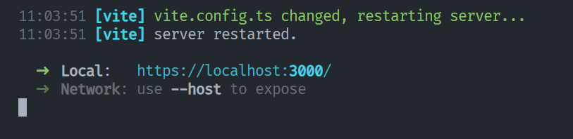
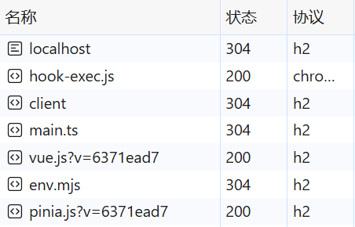

[[toc]]

虽然我们在 HTTP 协议下就可以完成大多数的开发工作，但在某些特殊情况可能就需要在 HTTPS 协议中进行开发和测试。

## 何时需要使用 HTTPS 进行本地开发

主要有以下几种情况：

- 设置 Secure Cookie

  Secure Cookie 仅在 HTTPS 上可以设置。在本地设置 Secure Cookie 时，并非所有浏览器都拥有相同的行为！例如，Chrome 和 Safari 不能在本地主机上设置 Secure Cookie，但 Firefox 可以。

- 调试混合内容问题

- 本地测试或重现 HTTP/2 或更高版本特有的行为

  在非安全的 HTTP/2 连接下，部分功能特性（特别是和安全相关或者新的性能优化特性）是不生效的。

- 使用需要 HTTPS 的第三方库或 API（例如 OAuth）

- 使用自定义主机名

  本地域名使用的不是 `localhost`，而是用于本地开发的自定义主机名。通常是修改了本地 hosts 文件，重新指定了对应本地 IP 的域名。在这种情况下，即使是本地，Chrome、Edge、Safari 和 Firefox 通常也不会将自定义主机名视为安全网站。

## 如何使用 HTTPS 进行本地开发

要实现 HTTPS 进行本地开发，本质就是需要给<u>本地域名 `localhost` 颁发一个可信任的证书</u>。我们可以利用一些工具，这里使用  [mkcert](https://github.com/FiloSottile/mkcert) 来帮助我们实现这一点。

mkcert 利用操作系统的本地信任机制创建自签名的证书。它会在本地计算机上创建一个本地的证书颁发机构（CA），这个 CA 是被添加到本地操作系统信任列表中的。然后它会基于这个本地 CA 来颁发证书。

### 使用 mkcert

1. 安装 mkcert

   在 Windows 操作系统中，可以通过 [Chocolatey](https://community.chocolatey.org/courses/installation/installing?method=installing-chocolatey) 来安装 mkcert：

   ```shell
   choco install mkcert
   ```

2. 生成一个本地可信任的证书授权机构 (CA)

   在终端中运行如下命令：

   ```shell
   mkcert -install
   ```

   该命令会生成一个本地证书授权机构 (CA)，该 CA 仅在设备上**本地**受信任。

3. 为本地域名生成由 mkcert 签名的证书

   在本地项目路径下，运行如下命令：

   ```shell
   mkcert localhost
   ```

   当然，如果你使用的是自定义主机名，则将 `localhost` 替换为自定义主机名即可。

   执行完该命令后会在当前路径下生成指定域名的证书文件和与之对应的私钥文件。


> 注意！**切勿导出或共享**这些 pem 文件，如果攻击者掌握了此文件，则可以对你可能访问的任何网站发起路径攻击。仅出于**开发目的**使用 mkcert，切勿要求最终的用户使用 mkcert。

4. 配置本地开发服务器以启用 HTTPS 协议

   以 Vite 为例，在 `vite.config.ts` 配置文件中设置 `server` 字段：

   ```ts
   server: {
     https: {
       key: fs.readFileSync('localhost-key.pem'),
       cert: fs.readFileSync('localhost.pem')
     }
   },
   ```

   启动项目，可以发现成功开启 HTTPS 协议。



在开启了 HTTPS 协议后，打开开发者工具的网络模块也可以发现，请求都采用了 h2 即 http/2.0 协议。而在 HTTP 协议下是采用 http/1.1 协议。

