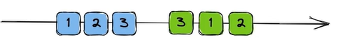
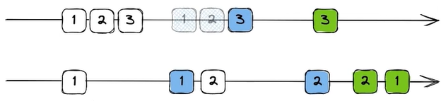

[[toc]]

搜索框提示词功能在大多数项目，尤其是搜索引擎中都会采用，以方便用户快速输入想要搜索的内容。



在实现中，如果用户每输入一个字符便进行一次提示词请求的发送，会导致一个问题，就是<u>响应不一定是有序到达</u>的，最后一次的响应并不一定对应最后一次发送的请求。因为在 http2.0 中请求的响应是可以并发传输的，即使是 http1.1或1.0 中请求和响应是按序进行的，但由于网络环境因素，也无法保证响应是按序到达的。



有人就说了，可以通过**防抖**来解决。但一样地，防抖也存在乱序问题，即第一次请求的响应由于网路环境因素导致延后到达，使得后续发起请求的响应被这个延后响应的结果覆盖。

## 异步任务队列

那如何解决这个问题呢？我们可以发现这些问题的本质就是由于**响应不是有序到达**所导致的，那么可以实现一个异步任务队列，把请求都加入到队列中，当<u>前一个请求响应到达后，再去发起下一个请求</u>，从而保证**用户操作（请求）的顺序跟响应的顺序一致**。

`Queue` 类包含两个成员变量，数组 `arr` 存储异步任务函数，`isRunning` 表示队列是否在执行中。

```js
class Queue {
    constructor() {
        this.arr = []
        this.isRunning = false
    }
}
```

`Queue` 类需要实现两个方法，添加异步任务的方法 `addQueue` 和 执行异步任务的方法 `execute`。

添加异步任务直接通过 `push` 方法向 `arr` 数组中压入异步任务的函数，这里压入的异步任务函数需要返回一个 `Promise` 对象。随后根据 `isRunning` 判断当前队列是否执行中来决定是否开始执行异步任务队列，以便后续添加新的任务时不会重复执行 `execute` 方法。

```js
addQueue(callback) {
    this.arr.push(callback)
    if (!this.isRunning) {
        this.isRunning = true
        this.execute()
    }
    return this
}
```

在 `execute` 方法中，从 `arr` 数组中的头部取出一个任务进行执行。在异步任务完成时即 `Promise` 兑现时，在其 `then` 方法中执行响应的回调函数（这里仅打印结果），随后递归调用 `execute` 方法以执行下一个异步任务。

```js
execute() {
    const task = this.arr.shift()
    if (task) {
        task().then((res) => {
            // 执行响应回调
            console.log(res)
            // 递归调用下一个异步任务
            this.execute()
        })
    } else this.isRunning = false
}
```

### 测试

现有两个异步任务，通过延迟器进行模拟。其中一个异步任务在完成时会向队列中添加一个新的异步任务，以模拟中途加入一个新的异步任务。

```js
function sayTheName() {
    return new Promise((resolve) => {
        setTimeout(() => {
            resolve("sayTheName")
            // 中途新增一个异步任务
            queue.addQueue(sayNextName)
        }, 4000)
    })
}

function sayNextName() {
    return new Promise((resolve) => {
        setTimeout(() => {
            resolve("sayNextName")
        }, 1000)
    })
}

const queue = new Queue().addQueue(sayTheName).addQueue(sayNextName)

// 结果
// 4秒后输出 sayTheName
// 接着1秒后输出 sayNextName
// 再过1秒后又输出 sayNextName
```

## 取消请求

另一种方法就是**取消请求**，即把之前的请求取消，发起一个新的请求，保证对于同一种请求而言同一时间只存在一个有效请求，从而避免响应结果被覆盖的情况。

对于 XHR 类型的请求，可以直接通过调用 XHR 对象上的 `abort` 方法来取消；对于 fetch 请求，则是通过 [`AbortController`](https://developer.mozilla.org/zh-CN/docs/Web/API/AbortController) 对象来实现。这里主要讲讲 `AbortController` 如何来取消请求。

首先，实例化一个 `AbortController` 对象 `controller`，在 fetch 请求的第二参数即 `options` 中设置 `signal` 为 `controller.signal`。`controller.signal` 会返回一个 [`AbortSignal`](https://developer.mozilla.org/zh-CN/docs/Web/API/AbortSignal) 对象实例，可以用它来和异步操作进行通信或者中止这个操作。若需要取消请求，直接调用 `controller.abort()` 方法即可。

在搜索框提示词场景中，每次发起请求前，执行控制器对象上的 `abort` 方法把之前的请求取消，然后再发起一个新的请求即可。

> 有点类似于防抖函数的实现，只是这里是请求层面的防抖，而我们常说的防抖是在事件触发层面上的。

```js
input.oninput = () => {
    let controller = null
    return async function() {
        controller && controller.abort()	// [!code highlight]
        controller = new AbortController()
        const list = await fetch('http://127.0.0.1:9527/api/search?key=' + input.value, {
            signal: controller.signal	// [!code highlight]
        }).then((res) => {
            controller = null
        })
    }
}
```

通常在开发过程中都会使用到第三方的请求库，例如 `axios`，而 `axios` 也是采用 `AbortController` 来进行取消请求的。

## 总结

这里所讨论响应乱序问题不止存在于搜索框提示词，还有许多类似的场景。比如页面中有多个 tab 页，通过点击 tab 页发起请求来获取用于展示不同的列表项数据，这里也会存在响应结果乱序的问题。