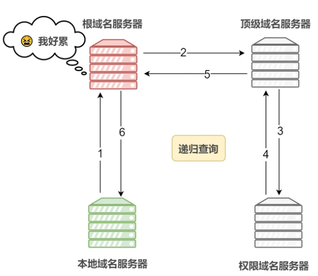

1. 浏览器先解析输入的内容，判断是否为 URL 地址。
2. 如果 URL 地址为域名，则需进行**DNS域名解析**。

DNS查询的方式主要有两种：

**递归查询**：如果 A 请求 B，那么 B 一定会为给 A 查询到想要的结果。

**迭代查询**：如果接收者 B 没有请求者 A 所需要的结果，那么 B 会告诉 A 如何去获取这个内容，但是自己并不会发出请求。

**DNS域名解析的过程**：

1. 首先搜索<u>浏览器中的DNS缓存</u>；

2. 如果没有命中，则搜索<u>操作系统本地的DNS缓存</u>；

3. 若仍未命中，则在本地域名服务器中采用**递归查询**内部的DNS缓存；

4. 若还未命中，则本地域名服务器会向上级的域名服务器进行**迭代查询**：

   - 先向根域名服务器发起查询请求，根域名服务器会将<u>顶级域名服务器的地址</u>返回给本地域名服务器；

   - 然后向顶级域名服务器发起查询请求，顶级域名服务器会将<u>权威域名服务器的地址</u>返回给本地域名服务器；

   - 最后向权威域名服务器发起查询请求，最终得到该域名对应的 IP 地址。

   - 获取到对应的 IP 地址后，则从本地域名服务器开始一层一层返回到浏览器中，在这个过程当中也会将该 IP 地址缓存起来。

5. 获取到 IP 地址后，便可以进行 **TCP** 的连接（<u>三次握手</u>过程），如果是 HTTPS 协议还要进行 **TLS** 的<u>四次握手</u>。

6. 在建立好 TCP 连接后，还会查看**浏览器缓存**（<u>强缓存和协商缓存</u>），如果有命中相应的缓存则直接从缓存中获取资源，而不再向服务端发送请求；否则，便向服务端发送 http 请求获取页面资源。

7. 服务端响应请求并返回资源，客户端获取到资源后便开始进行资源的解析，进行页面的**渲染过程**。
