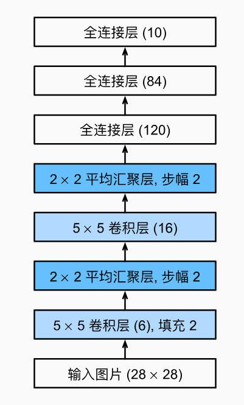
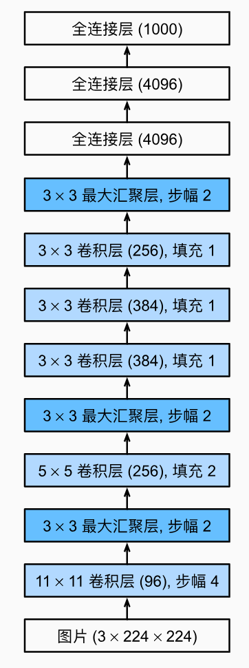
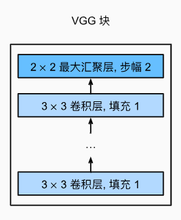
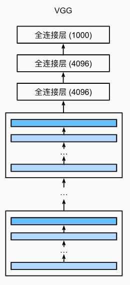
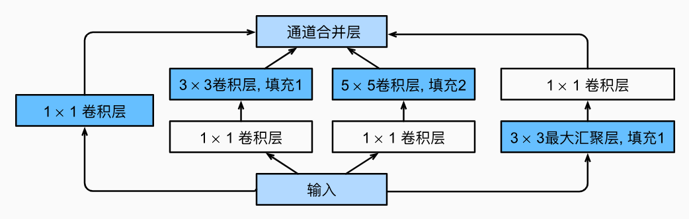
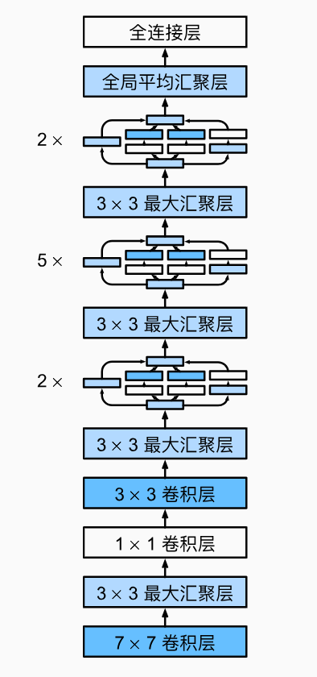
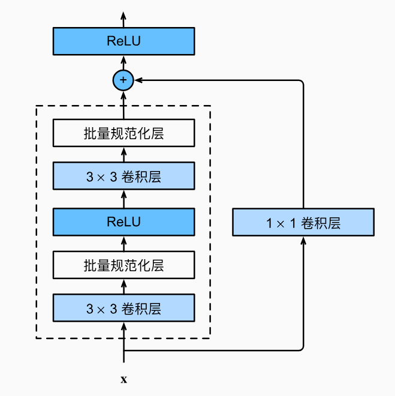
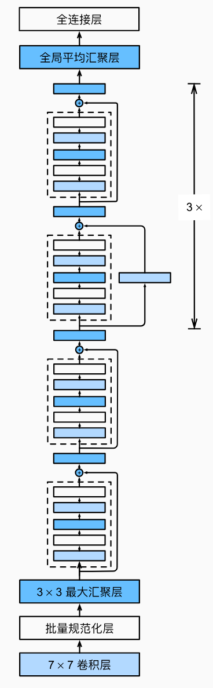

[[toc]]

最近在学深度学习，总结下部分知识点。

## 欠拟合和过拟合

### 出现原因

**欠拟合**的主要原因：

1. **模型复杂度不足**：模型过于简单，无法很好地拟合复杂数据集。
2. **训练不足**：训练迭代的次数不够，模型没有充分学习数据的特征。

**过拟合**的主要原因：

1. **模型过于复杂**：在简单训练数据集下，模型太复杂（过于复杂的模型会轻易受到训练数据中噪声的影响），导致过于拟合训练数据集，使得训练的模型泛化能力差。
2. **数据集样本不足**：当训练数据量不足时，模型可能会过度拟合训练集中的数据点。

### 解决方法

对于**欠拟合**：

- 选择更加复杂的模型。
- 在模型的复杂度匹配数据集的前提下，适当增加训练的迭代次数。

对于**过拟合**而言，我们可以增大数据集样本数量。但收集更多的数据集意味着会加大成本，所以还可以通过一些正则化技术来解决：

- **权重衰退**

  通过为模型损失函数添加惩罚项使学出的模型参数值较小，通常会使学到的权重参数的元素较接近0。从而使得模型不会轻易受到训练数据中的噪声影响。
  $$
  w_{t+1}=(1-nλ)w_t-η\frac{∂ℓ(w_t,b_t)}{∂w_t}
  $$

- **丢弃法**

  丢弃法的思路为在训练过程中以一定概率丢弃隐藏层中的输出项，使得最终的输出不会过度依赖任一项输入（即隐藏层的输出），从而在训练模型时起到正则化的作用，以应对过拟合。

  为了使得丢弃法不改变输入的期望值，我们会对未被丢弃的元素进行放大：
  $$
  \because x'_i=\begin{cases}  
  0 & p的概率 \\
  \frac{x_i}{1-p} & 1-p的概率
  \end{cases}
  \\
  \therefore E(x'_i)=p\cdot0+(1-p)\cdot\frac{x_i}{1-p}=x_i
  $$

  ## 数据稳定性

  当神经网络的层数较多时，模型的数据稳定性容易变差，从而导致数据爆炸或者衰减。类似地，当层数较多时，梯度的计算也更容易出现消失或爆炸。而梯度消失会影响训练效率，导致收敛过慢；梯度爆炸可能会使得数值溢出，导致训练中断，或者使得权重的更新值变得极端，超过了优化算法所能有效处理的范围，使得网络的参数无法稳定地收敛到最优解。

  ### 解决方法

  - **Xavier ** 随机初始化权重参数

    假设某全连接层的输入个数为*a*，输出个数为*b*，Xavier随机初始化将使该层中权重参数的每个元素都随机采样于正态分布或均匀分布。
    $$
    N\left(0,\sqrt{\frac{2}{a+b}} \right),
    \\
    U\left(-\sqrt{\frac{6}{a+b}},\sqrt{\frac{6}{a+b}} \right).
    $$
    它的设计主要考虑到，模型参数初始化后，每层输出的方差不该受该层输入个数影响，且每层梯度的方差也不该受该层输出个数影响，从而减少初期的不稳定性。

    同时由于隐藏层的输出还要经过激活函数计算，所以为了保证最终的输出满足分布，故还要选择合适的激活函数。选择的激活函数在分布区间需要满足近似线性变化，例如 `tanh` 、`relu` 等。

  - **Batch Normalization**

    **BN** 即对每层的输出（入）进行标准化处理（即标准化到均值为0，方差为1的分布），然后对这些标准化后的数据进行缩放和平移操作，以帮助网络在训练过程中保持稳定，从而提高训练效率。

    首先，对由 m 个样本组成的小批量 B 求均值和方差：
    $$
    \mu_B=\frac{1}{m}\sum^m_{i=1}x^{(i)},
    \\
    \sigma_B^2=\frac{1}{m}\sum^m_{i=1}(x^{(i)}-\mu_B)^2,
    $$
    其中的平方计算是按元素求平方。接下来，使用按元素开方和按元素除法对每个输出（入）标准化：
    $$
    \hat{x}^{(i)}=\frac{x^{(i)}-\mu_B}{\sqrt{\sigma^2_B+\epsilon}},
    $$
    这里 *ϵ* > 0 是一个很小的常数，避免方差为0导致的分母为0的情况。在上面标准化的基础上，BN 层引入了两个可以学习的模型参数，拉伸（scale）参数 𝛾 和偏移（shift）参数 𝛽。这两个参数和 𝑥(𝑖) 形状相同，皆为 𝑑 维向量。它们与 𝑥^(𝑖) 分别做按元素乘法（符号⊙）和加法计算：
    $$
    y^{(i)}=\gamma⊙\hat{x}^{(i)}+\beta.
    $$
    对于预测时，我们希望模型对于任意输入都有确定的输出。因此，单个样本的输出不应取决于 BN 所需要的随机小批量中的均值和方差。一种常用的方法是通过**移动平均**估算整个训练数据集的样本均值和方差，并在预测时使用它们得到确定的输出。

  ## 卷积神经网络

  主要记录下经典的卷积神经网络模型

  ### LeNet

  
  
  卷积层块里的基本单位是卷积层后接平均池化层：卷积层用来识别图像里的空间模式，之后的池化层则用来降低卷积层对位置的敏感性。卷积层块由两个这样的基本单位重复堆叠构成。
  
  ### AlexNet
  
  
  
  AlexNet 和 LeNet 的设计理念非常相似，但也存在显著差异。
  
  1. AlexNet 比相对较小的 LeNet 要深得多。AlexNet 由八层组成：五个卷积层、两个全连接隐藏层和一个全连接输出层。
  2. AlexNet 使用 ReLU 而不是 sigmoid 作为其激活函数。
  3. AlexNet 通过丢弃法来控制全连接层的模型复杂度。而 LeNet 并没有使用丢弃法。
  4. AlexNet 引入了大量的图像增广，从而进一步扩大数据集来缓解过拟合。
  5. AlexNet 将平均池化层改用了最大池化层。
  
  ### VGG
  
  VGG 提出了可以通过重复使用简单的基础块来构建深度模型的思路，即提出了一种卷积神经网络的设计架构。
  
  **VGG块**的组成规律是：连续使用数个相同的填充为1、窗口形状为 **3×3** 的卷积层后接上一个步幅为2、窗口形状为 **2×2** 的最大池化层。卷积层保持输入的高和宽不变，而池化层则对其减半。
  
  
  
  与 AlexNet、LeNet 一样，VGG 网络可以分为两部分：第一部分主要由卷积层和池化层组成，第二部分由全连接层组成。
  
  
  
  原始 VGG 网络有5个卷积块，其中前两个块各有一个卷积层，后三个块各包含两个卷积层。 第一个模块有64个输出通道，每个后续模块将输出通道数量翻倍，直到该数字达到512。由于该网络使用8个卷积层和3个全连接层，因此它通常被称为 VGG-11 。
  
  ### GoogLeNet
  
  GoogLeNet 的一个最大特点就是使用了不同大小的卷积核的组合来构造网络。
  
  在 GoogLeNet 中，基本的卷积块被称为 **Inception 块**。Inception块由四条并行路径组成。前三条路径使用窗口大小为 1×1、3×3 和  5×5 的卷积层，从不同空间大小中提取信息。中间的两条路径在输入上执行 1×1 卷积，以减少通道数，从而降低模型的复杂性。第四条路径使用 3×3 最大汇聚层，然后使用 1×1 卷积层来改变通道数。
  
  
  
  GoogLeNet 一共使用9个 Inception 块和全局平均汇聚层的堆叠来生成其估计值。Inception 块之间的最大汇聚层可降低维度。 第一个模块类似于 AlexNet 和 LeNet ，Inception 块的组合从 VGG 继承，**全局平均汇聚层避免了在最后使用全连接层**。
  
  
  
  ### ResNet
  
  ResNet 的主要思想是将新添加的层训练成**恒等映射**，即 ***f(x) = x***，这样就可以使得新模型和原模型将同样有效。
  
  假设我们希望学出的理想映射为 ***f(x)*** ，则当前层需要拟合出有关恒等映射的残差映射 ***g(x)=f(x)-x***，然后将该残差映射加上当前层的输入 ***x***，即得出 ***f(x)=g(x)+x***。
  
  这种思想也使得 ResNet 可以训练出非常深层的模型，因为它可以很好地处理梯度消失：
  $$
  假设y=f(x),x为输入，y为输出，w为权重，f(x)为某一层的计算函数（包括损失函数），g(x)为其他层的计算函数
  \\
  非残差网络：y'=g(f(x))
  \\
  梯度：\frac{∂y'}{∂w}=\frac{∂g(y)}{∂y}\frac{∂y}{∂w}
  \\
  残差网络：y''=f(x)+g(f(x))
  \\
  梯度：\frac{∂y''}{∂w}=\frac{∂y}{∂w}+\frac{∂y'}{∂w}
  $$
  可以发现，在残差网络下计算梯度时，由于加上了之前层的输入，梯度也加上了之前层的梯度大小，保证了得出的梯度不会由于乘积导致过小，很好地处理了梯度消失问题。
  
  
  
  再来看看 ResNet 的整体网络结构。ResNet 的前两层跟之前介绍的 GoogLeNet 中的一样：在输出通道数为64、步幅为2的 7×7 卷积层后，接步幅为2的 3×3 的最大池化层。不同之处在于 ResNet 每个卷积层后增加了批量规范化层。
  
  ResNet 使用4个由残差块组成的模块，每个模块使用若干个同样输出通道数的残差块。第一个模块的通道数同输入通道数一致，因为之前已经使用了步幅为2的最大池化层减半了高宽，所以此处无须再减小。之后的每个模块的第一个残差块里将上一个模块的通道数翻倍，并将高和宽减半（通常而言即使用步幅为2的 3×3 的卷积将输入高宽减半通道数翻倍，并使用 1×1 的卷积将之前输入的通道数翻倍从而使得通道数一致以与输出进行相加）。
  
  
  
  ## 关于batchSize的一些注意
  
  batchSize 达到一定程度，每个 batch 内的样本的多样性不会比之前有多大增长，对梯度的贡献也不会比之前的 batch 大多少，但是大的 batchSize 却会带来更多的训练时间，就造成了训练有效性下降。